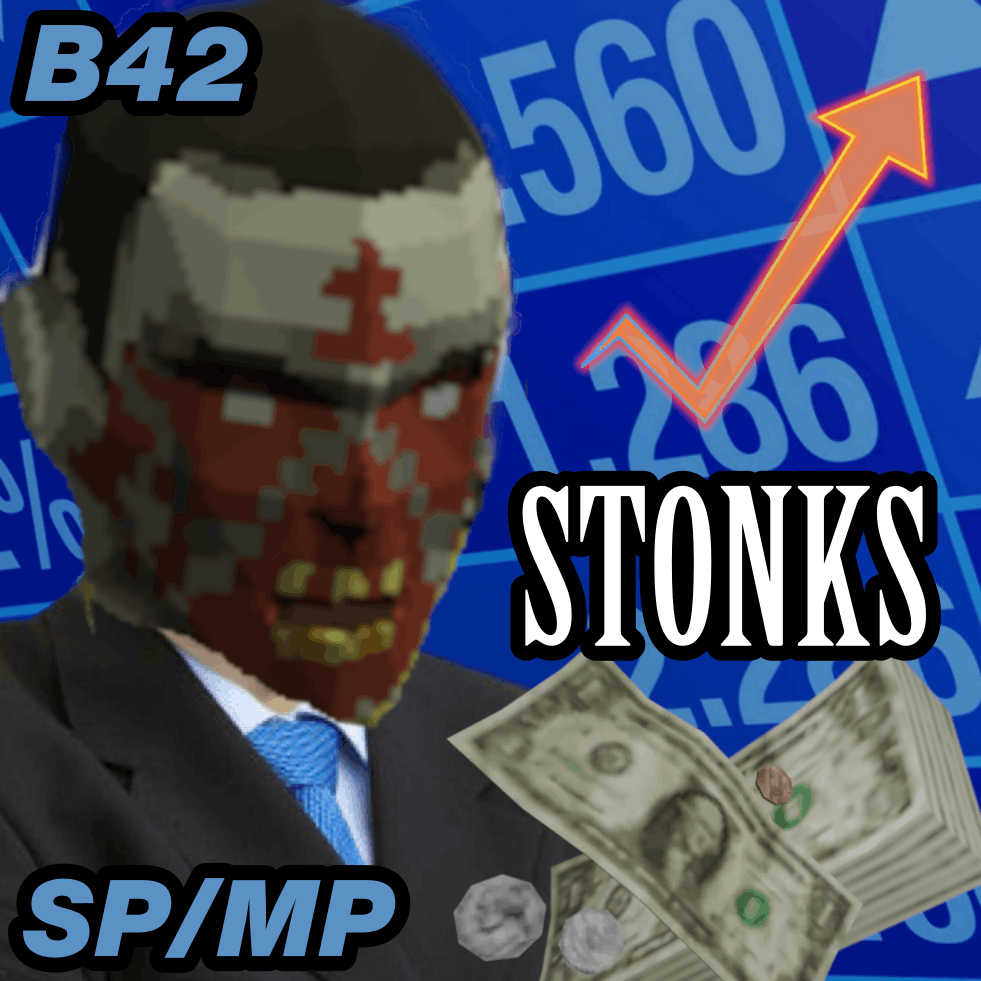
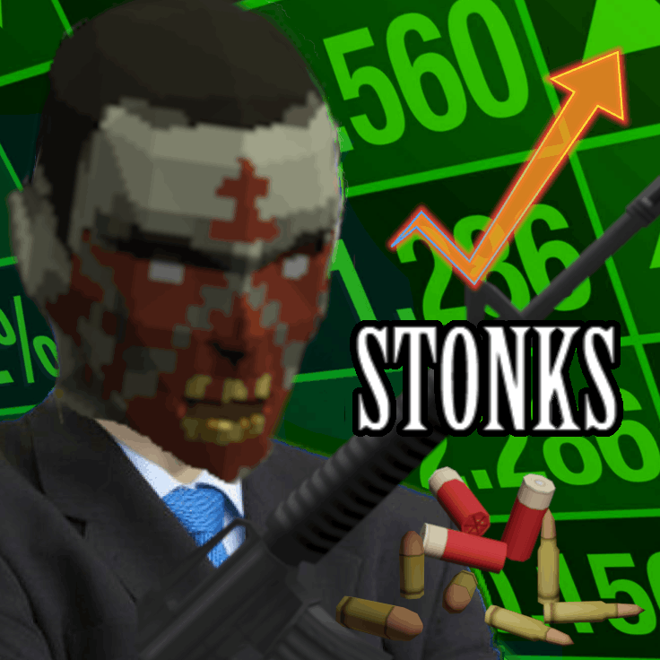

# NoxDocs

Documentation for **ObnoxiouslyNoxious's** Project Zomboid Mods

**NoxDocs is a Work In Progress**

## Mods

-   { .card-thumb }
    **[Zombies Have Money](mods/zombies-have-money.md)**
    B42SP/MP

    Adds a configurable chance for Zombies to drop Money & Money Bundles on death, on top of vanilla drop behaviour.

-   { .card-thumb }
    **[Zombies Have Ammo](mods/zombies-have-ammo.md)**
    B42SP/MP

    ds a configurable chance for Zombies to drop Ammo & Ammo Boxes on death, on top of vanilla drop behaviour.

