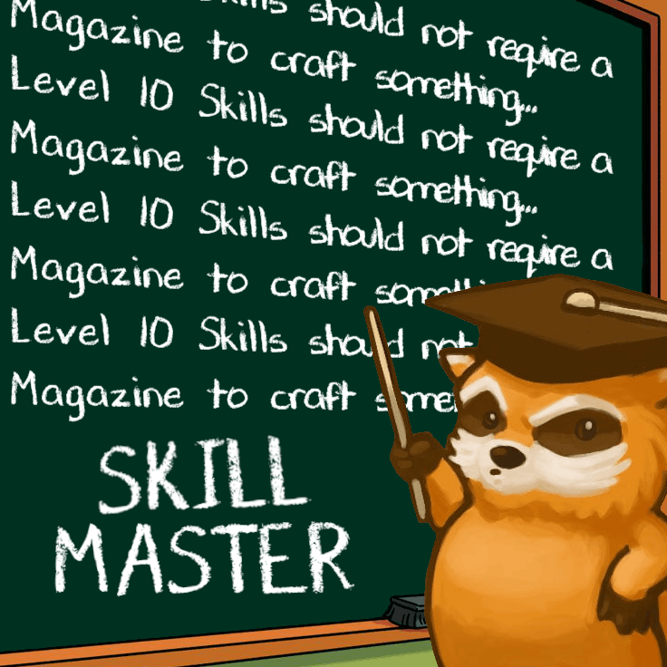
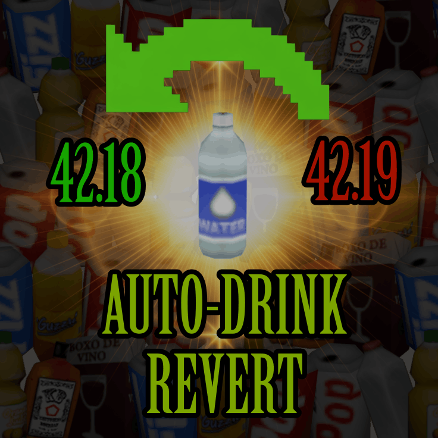

# NoxDocs

Documentation for **ObnoxiouslyNoxious's** Project Zomboid Mods

**NoxDocs is a Work In Progress**

## Mods

-   { .card-thumb }
    **[Random Spawn Locations](mods/random-spawn-locations.md)**
    B42MP

    Replaces all Vanilla spawn options with a single 'Random Spawn' choice. Uses a curated pool of thousands of verified spawn points spread across Knox Country. 
    {: .hidden }

-   { .card-thumb }
    **[Skill Master](mods/skill-master.md)**
    B42SP/MP

    Unlocks all Magazine or Research gated Recipes when Players achieve Level 10 in the relevant Skill.
    {: .hidden }

-   { .card-thumb }
    **[Zombies Have Smokes](mods/zombies-have-smokes.md)**
    B42SP/MP

    Adds a configurable chance for Zombies to drop Cigarettes, Lighters, Tobacco, Cigars, Cigarillos, and Cigarette Cartons on death, on top of vanilla drop behaviour.
    {: .hidden }

-   { .card-thumb }
    **[Zombies Have Ammo](mods/zombies-have-ammo.md)**
    B42SP/MP

    Adds a configurable chance for Zombies to drop loose Ammo and Ammo Packs on death, on top of vanilla drop behaviour. Compatible with Vanilla Firearms Expanded & Guns of Marz.
    {: .hidden }

-   { .card-thumb }
    **[Zombies Have Money](mods/zombies-have-money.md)**
    B42SP/MP

    Adds a configurable chance for Zombies to drop Money & Money Bundles on death, on top of vanilla drop behaviour.

-   { .card-thumb }
    **[AEBS Imperial & Metric Display](mods/aebs-converter.md)**
    B42SP/MP

    Appends both units (Fahrenheit/Celsius & Kilometres/Miles) to every AEBS Temperature and Wind Speed broadcast, so all Clients always see both Imperial and Metric units regardless of the Server's region.
    {: .hidden }

-   { .card-thumb }
    **[Auto-Drink Revert](mods/auto-drink-revert.md)**
    B42.19+SP/MP

    Reverts Auto-Drink behaviour to pre-Build 42.19 behaviour, requiring any container to have 51%+ Water to trigger the Auto-Drink function.
    {: .hidden }

-   { .card-thumb }
    **[NPC Tiles](mods/tiles-npc.md)**
    B42SP/MP

    A B42 Compatibility port for *Vass. & Destiny's* NPC Tiles Mod. Adds 84 Human NPC Tiles/Sprites and an 'NPC Tile Placer' script for Singleplayer and Multiplayer Admins.
    {: .hidden }

-   { .card-thumb }
    **[Daily Challenges & Leaderboard](mods/daily-challenge-system.md)**
    B42SP/MP

    Generates 7 Daily Challenges for Players to complete every 24 hours to earn Tokens. Tokens can be spent at the 'Token Vendor'. Includes a Leaderboard for Multiplayer Servers and a Hall of Fame for Singleplayer.
    {: .hidden }

