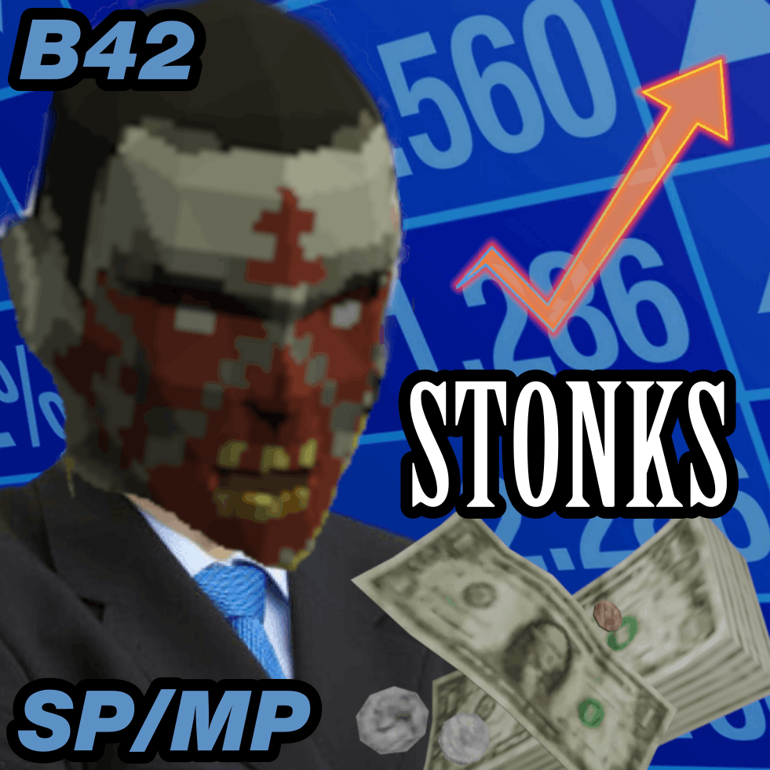
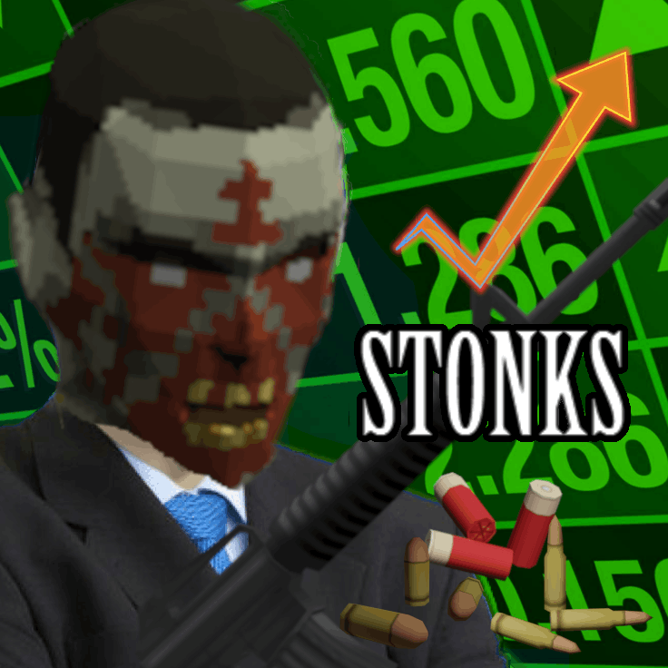
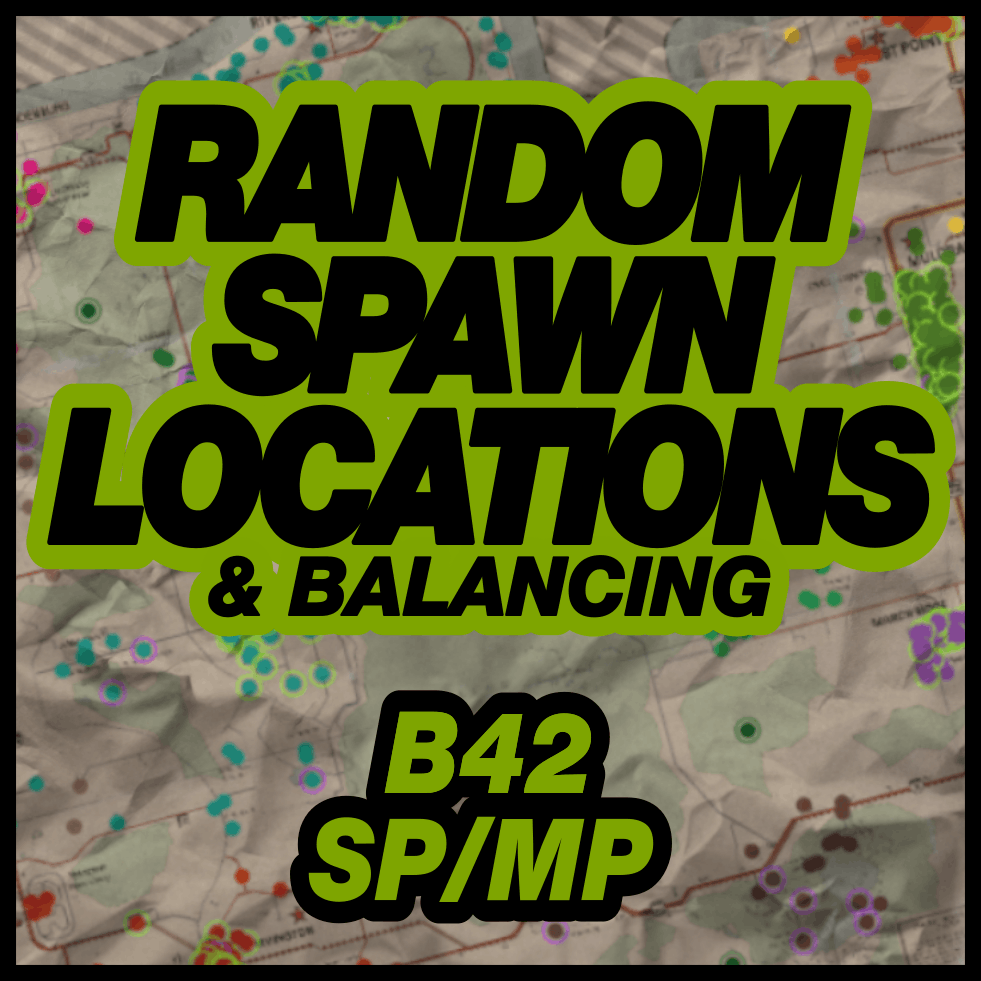
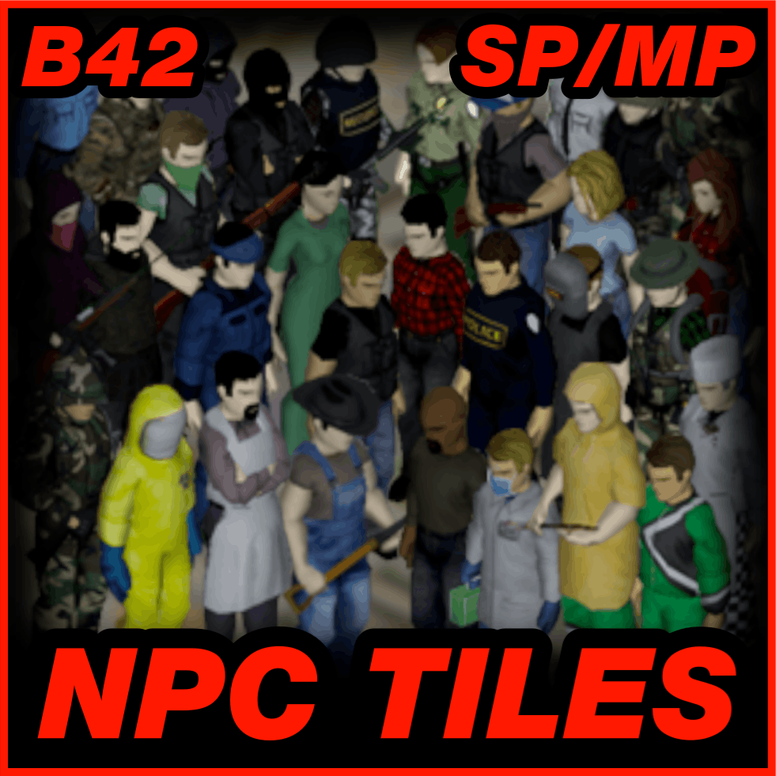

# NoxDocs

Documentation for **ObnoxiouslyNoxious's** Project Zomboid Mods

**NoxDocs is a Work In Progress**

## Mods

-   { .card-thumb }
    **[Zombies Have Money](mods/zombies-have-money.md)**
    B42SP/MP

    Adds a configurable chance for Zombies to drop Money & Money Bundles on death, on top of vanilla drop behaviour.

-   { .card-thumb }
    **[Zombies Have Smokes](mods/zombies-have-smokes.md)**
    B42SP/MP

    Adds a configurable chance for Zombies to drop Cigarettes, Lighters & Tobacco Products on death, on top of vanilla drop behaviour.

-   { .card-thumb }
    **[Zombies Have Ammo](mods/zombies-have-ammo.md)**
    B42SP/MP

    Adds a configurable chance for Zombies to drop Ammo & Ammo Boxes on death, on top of vanilla drop behaviour.

-   { .card-thumb }
    **[Random Spawn Locations](mods/random-spawn-locations.md)**
    B42SP/MP

    Replaces all Vanilla spawn choices with a single **"Random Spawn, KY"** option, choosing one of thousands of Spawn points spread across Knox Country.

-   { .card-thumb }
    **[NPC Tiles](mods/npc-tiles.md)**
    B42SP/MP

    Adds 84 Human NPC Tiles/Sprites and a script for Singleplayer and Multiplayer Admins to place NPC Tiles as static objects or as Containers.

