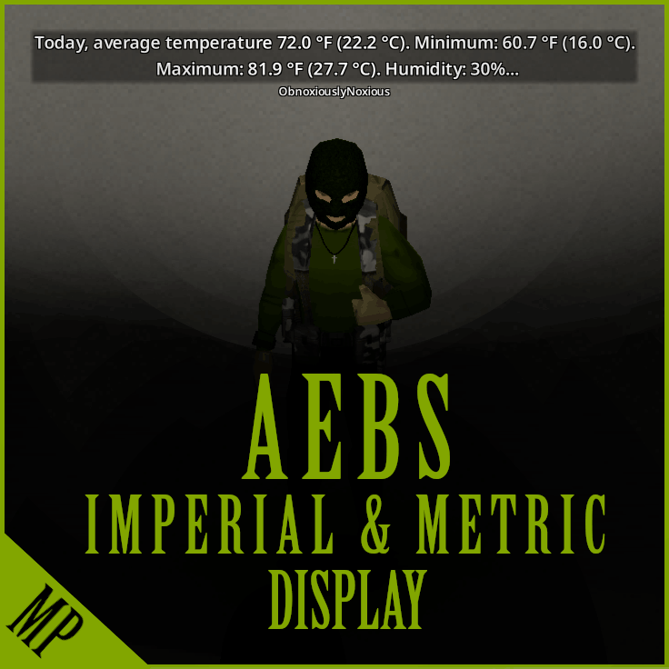

# **AEBS Imperial & Metric Display**

<div class="mod-hero" markdown>

{ .mod-icon }

<span class="pz-tag">B42</span><span class="pz-tag">SP/MP</span>

*You haven't got time to convert AEBS Broadcast units mid-horde. Now you don't have to.*

**Build:** 42.16+ | **SP/MP:** Multiplayer-focused, works in Singleplayer

[:fontawesome-brands-steam-symbol: Steam Workshop](#)

</div>

## Overview

On multiplayer servers, the AEBS Radio Broadcast displays temperature and wind speed units based on the **system region of the machine hosting the server**, regardless of what an individual client has set in their own game options. This mod appends both units (Metric and Imperial) to every AEBS broadcast, so all clients see both regardless of the server's region.

**Example:**

- Metric-region server: `17.0 °C (62.6 °F)` and `20.8 KpH (12.9 MpH)`
- Imperial-region server: `62.6 °F (17.0 °C)` and `12.9 MpH (20.8 KpH)`

## Gallery

<!--
<div class="gallery-grid" markdown>
 
</div>
-->

## Features

- Appends both Metric and Imperial units to every AEBS temperature and wind speed broadcast
- Server's native unit is always shown first, with the converted unit in brackets
- Display-only change — no game data is modified
- No configuration required; automatically detects the server's unit setting

## How It Works

The mod intercepts the AEBS Broadcast at the point the weather text is generated on the server, appending the converted unit in brackets after each temperature and wind speed value.

## Installation

Subscribe to the mod on Steam Workshop and add it to your mod list — no server-side files are required:

```ini
Mods=AEBSConverter
```

## Configuration

No configuration required — the mod automatically detects the server's unit setting and appends the converted unit accordingly.

## Compatibility

| Build |  SP | Hosted MP | Dedicated MP
|:---:|:---:|:---:|:---:|
| 42.16+ | ✅ | ✅ | ✅ |
| 41 or earlier / Build 42 < 42.16 | ❌ | ❌ | ❌ |

Not needed in Singleplayer — SP already respects your Temperature Display setting. Should be compatible with all radio mods — does not modify any radio scripts, distributions, or broadcast data. Safe to add or remove at any time; no world data is touched.

## FAQ / Troubleshooting

!!! question "Why does this matter — doesn't the game already respect my unit preference?"

    For most UI, yes. But the AEBS Radio Broadcast is tied to the *server machine's* system region and can't be changed per-client — this mod is the workaround for servers with an international or inter-regional playerbase.

!!! question "Do I need this in Singleplayer?"

    No — Singleplayer already respects your Temperature Display setting. You can still use it if you'd like to see both units simultaneously.

## Credits

- [Steam Workshop](#)

## Changelog

See the mod's Steam Workshop page for the full version history.
