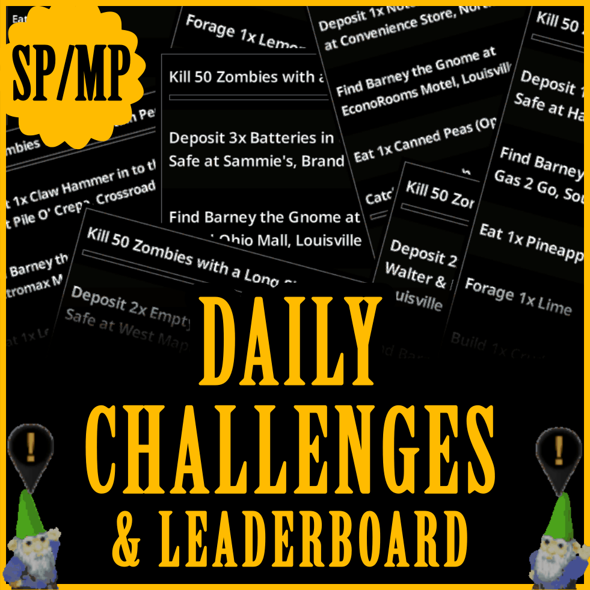

# **Daily Challenges & Leaderboard**

<div class="mod-hero" markdown>

{ .mod-icon }

<span class="pz-tag">B42.15+</span><span class="pz-tag">SP/MP</span>

**Recommended Build:** 42.15+

**Topology Compatibility:** Singleplayer & Multiplayer (Dedicated & Hosted)

[:fontawesome-brands-steam-symbol: Steam Workshop](https://steamcommunity.com/sharedfiles/filedetails/?id=3752111970)

</div>

## Overview

Daily Challenges & Leaderboard gives your Project Zomboid playthrough a brand-new progression system that incentivizes Daily log-ins. Every day at Midnight UTC, 7 new Challenges become available. Complete them to earn Tokens and exchange those Tokens for Items at the 'Token Vendor'. In Multiplayer, a persistent Leaderboard tracks Challenge Totals, Streaks, Token totals and Fastes Completion Times across all Players on the Server. In Singleplayer, a Hall Of Fame tracks Challenge Totals, Streaks and Fastest Completion Times across your past and present Characters.

## Gallery

<!--
<div class="gallery-grid" markdown>
 
</div>
-->

## Features

- **7 Challenge Categories (One active Challenge per Category, per day):**
    - **Kills/Weapon**: Slay Zombies with anything from a Broom to an M16. Generic kill-count Challenges plus weapon-specific ones covering nearly every melee, firearm, and improvised weapon. (318 Challenges)
    - **Quest/Deliver**: Find the required item(s), travel to the location and deposit them into the designated Safe. (93 Items across 1,193 Locations = 110,949 unique Challenge combinations)
    - **Find the Gnome/Visit**: David's cousin, Barney the Gnome has landed in Knox Country. Head to the location and find Barney to complete the Challenge. (1,193 Locations)
    - **Eat/Drink**: Cook and eat specific meals, consume non-perishables, or forage/farm fresh produce. (168 Challenges)
    - **Fish/Hunt/Forage**: Reel in a specific fish, hunt a wild animal, or forage for materials in the wilderness. (52 Challenges)
    - **Craft/Build**: Craft tools, weapons and clothes, or build walls, fences, doors, crates and other structures. (223 Challenges)
    - **Miscellaneous**: Travel set distances on foot or by Vehicle, read books/magazines, change hairstyle/makeup, install/remove vehicle parts and more. (122 Challenges)

- **Streak & Rewards:** Complete 1 Challenge per day to maintain a Streak, pushing you through 4 reward tiers over 28 days. Early tiers pay 1 Token per Challenge, the final tier pays 4 Tokens per Challenge. Finish all 7 Challenges in a day for Bonus Tokens, and a full 28-day Streak nets a 25-token milestone before the Cycle resets.

- **Token Vendor:** Exchange Tokens for Items. Each Vendor shows a rotating selection (~18 items, balanced across categories) instead of the full catalogue. Stock and selection refresh Daily, and Admins can adjust the rotation size via "Limit Shop Items" in DCS Settings. Two random Vendor locations spawn daily (East + West), each carrying different items. Complete all 7 Challenges to unlock their locations.

- **Leaderboard:**  Compete with other Players (or your previous Characters in Singleplayer) for Most Challenges Completed, Longest Streak, Fastest Completion time and more. Singleplayer's personal Hall of Fame tracks Most Completed, Longest Streak, and Fastest 7.

- **Optional: Challenge Progress Persists Through Death** (Singleplayer Only) — Your Daily Challenge progress persists through Character death.

## Installation

**Singleplayer:** Subscribe to the Mod on Steam Workshop and enable it from the 'Choose Mods' screen.

**Multiplayer (Hosted & Dedicated):** Subscribe to the Mod on Steam Workshop and add the below lines to your Server's .ini file

```ini
Mods=DailyChallengeSystem
WorkshopItems=3752111970;
```

## How It Works

At Midnight UTC (or on server start), DCS rolls one Challenge from each of the 7 Category pools and rotates which Locations are used for Quest, Visit & Trader Locations. The DCS System uses the Date as a Seed and by default, all Servers have matching Challenges for the day. Users can complete a Challenge by fulfilling it's requirement(s). Client's progress is tracked and verified against the Server authoritatively. 

### Streak Tiers & Rewards

| Streak Tier | Daily Streak | Tokens per Challenge | Bonus Tokens | Max Tokens per Day |
|---|---|---|---|---|
| 1 | Day 1–7 | +1 | +3 | 10 |
| 2 | Day 8–14 | +2 | +6 | 20 |
| 3 | Day 15–21 | +3 | +9 | 30 |
| 4 | Day 22–28 | +4 | +12 | 40 |

Maintaining a Daily Streak through a full 28-Day cycle grants an additional **+25 token** Bonus before the cycle resets back to Tier 1.

## Configuration

DCS Settings are accesible in:

**Singleplayer:** By opening the Game in Debug Mode, right-clicking anywhere and choosing 'DCS Admin Menu' in the Context Menu.

**Multiplayer:** By joining the Server with an account that has Admin permissions and using the Vanilla PZ Admin Menu, or right-clicking anywhere and choosing 'DCS Admin Menu' in the Context Menu.

| Setting | Default | Description |
|---|---|---|
| Challenge Progress Persists Through Death | Off | Singleplayer only. When enabled, your current day's Challenge Progress survives Character death instead of resetting. |
| Limit Shop Items | On | When enabled,  |

## Compatibility

| Build |  SP | Hosted MP | Dedicated MP
|:---:|:---:|:---:|:---:|
| 42.15+ | ✅ | ✅ | ✅ |
| < 42.15 | ❌ | ❌ | ❌ |

## FAQ / Troubleshooting

!!! question "When do challenges reset?"

    At UTC midnight, checked server-side roughly once a minute — so the reset lands within about a minute of the boundary.

!!! question "Does my streak reset if I miss a day?"

    Yes — the streak tier system is built around consecutive days. Missing a day drops you back to the start of the tier progression.

!!! question "I died and lost my daily progress — is that normal?"

    By default yes, in both singleplayer and multiplayer. In singleplayer, enable "Challenge Progress Persists Through Death" to keep progress across deaths.

!!! question "Will other players see my leaderboard stats?"

    In multiplayer, the leaderboard tab is visible to everyone on the server. In singleplayer, it's a personal history only you see.

## Credits

- [Steam Workshop](#)

## Changelog

**v1.0.3**

- Added "Challenge Progress Persists Through Death" option for singleplayer
- Added a sidebar reminder wiggle if the panel hasn't been opened within 2 minutes of logging in
- Fixed stomp kills not counting toward Weapon/Category Kill challenges
- Fixed quest items with alternate variants not being recognized for completion
- Fixed quest items carried in a backpack not being removed on turn-in
- Fixed Category Kill challenge progress showing yesterday's count briefly after reset
- Fixed daily reset creating a new backup file every day instead of reusing one, causing unbounded backup growth
- Fixed the "Current Most Tokens" leaderboard not updating after spending currency
- Fixed a small number of outdoor-only challenge spawns occasionally placing indoors
- Fixed offline players' streak leaderboard entries never resetting after a missed day
- Fixed Token Vendor stock re-rolling on every server restart instead of staying stable until the next daily reset
- Fixed several weapon types not being recognized for Weapon/Category Kill challenges
- Fixed multi-item foraging only counting as 1 toward challenge progress
- Fixed "Hunt any X Wild Animals" challenges never progressing
- Large-scale internal code refactor and optimization pass

See the mod's Steam Workshop page for the full version history.
