# **NPC Tiles**

<div class="mod-hero" markdown>

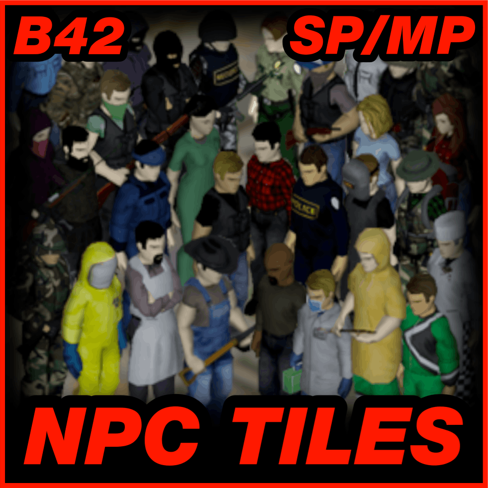{ .mod-icon }

<span class="pz-tag">B42</span><span class="pz-tag">SP/MP</span>

[:fontawesome-brands-steam-symbol: Steam Workshop](https://steamcommunity.com/sharedfiles/filedetails/?id=3759853561)

**Recommended Build:** 42.15+

</div>

## Overview

NPC Tiles is a **Build 42 Compatibility Port** of [Destiny & Vass's original NPC Tiles Mod](https://steamcommunity.com/sharedfiles/filedetails/?id=3344981715). It adds 84 placeable, static, human-figure Tile objects. Useful for creating Scenes for Screenshots or NPC Traders/Mission Markers. Includes an 'NPC Tile Placer' script for Singleplayer and Multiplayer Admins, plus a Container variant with configuirable storage capacity.

## Gallery

<div class="gallery-grid" markdown>
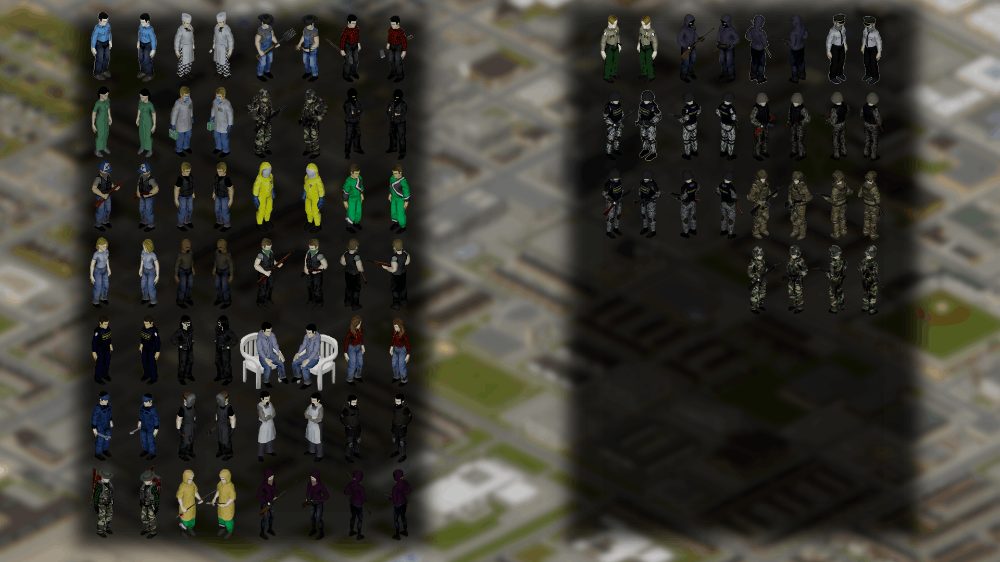 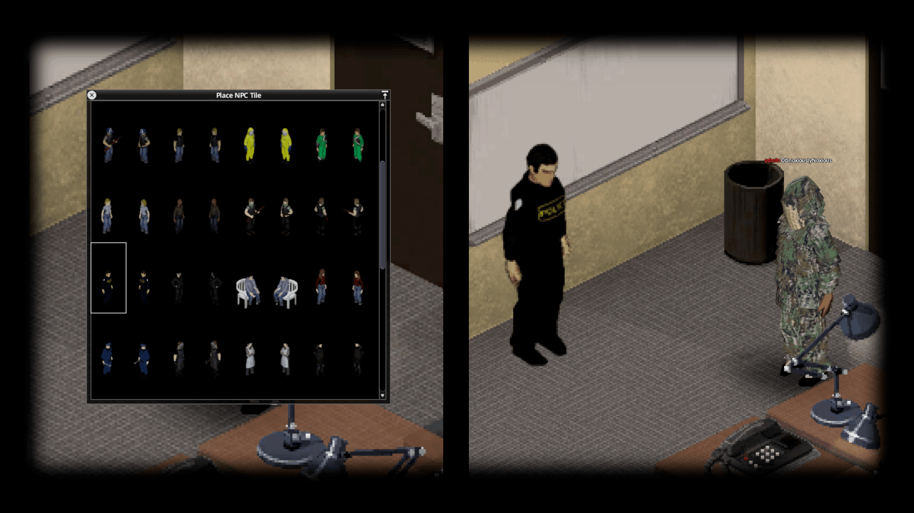 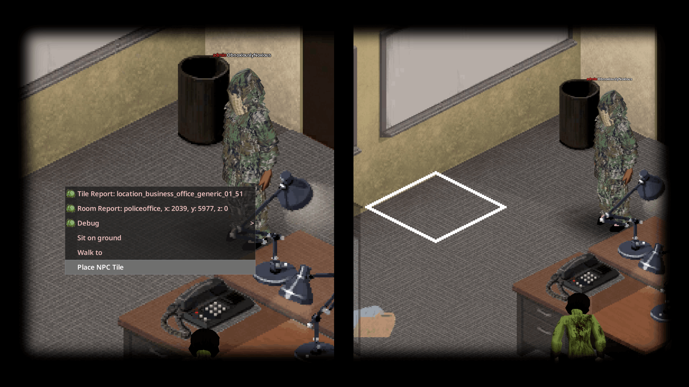 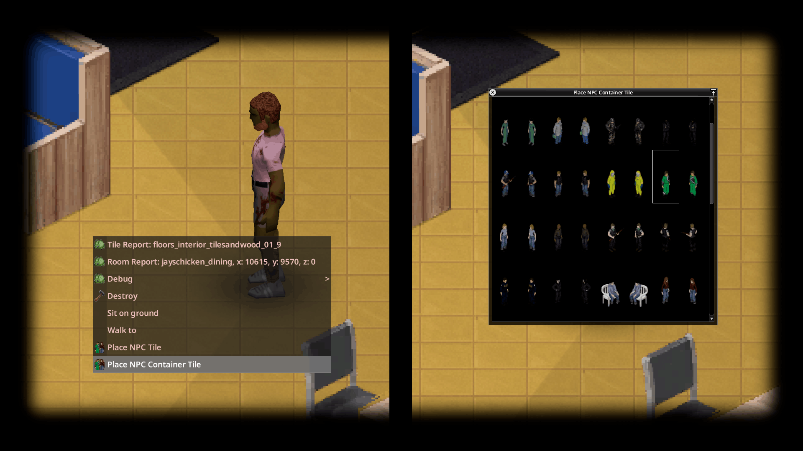 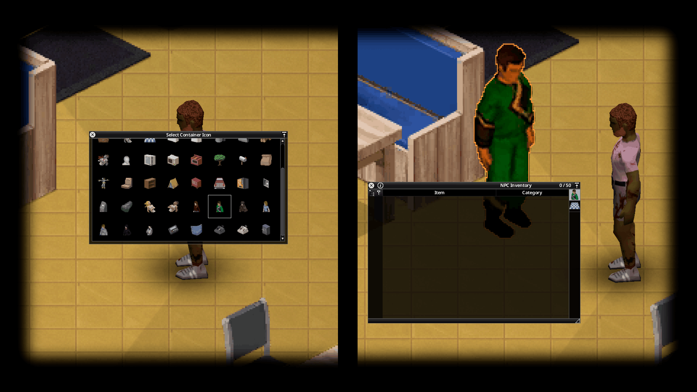 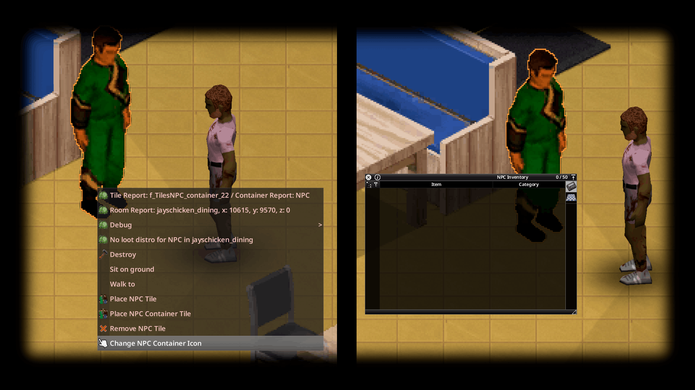 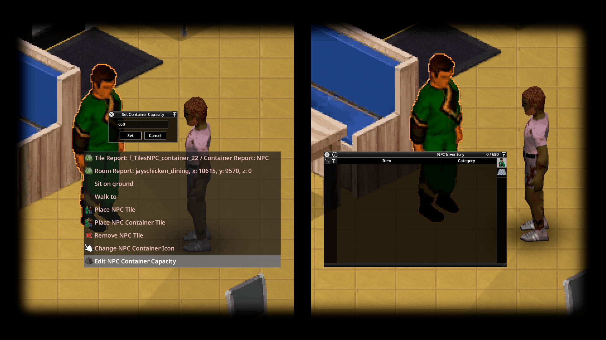 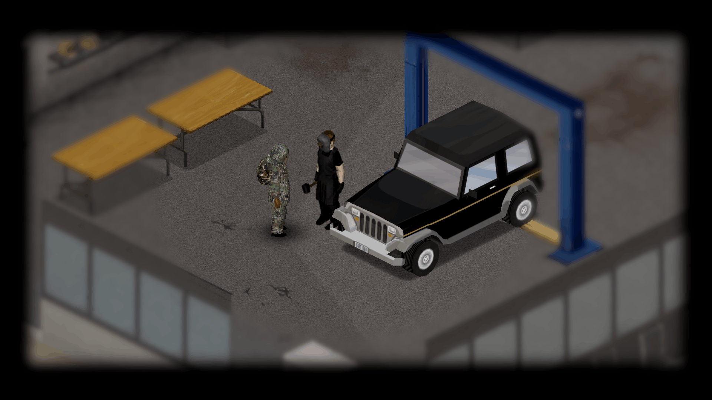 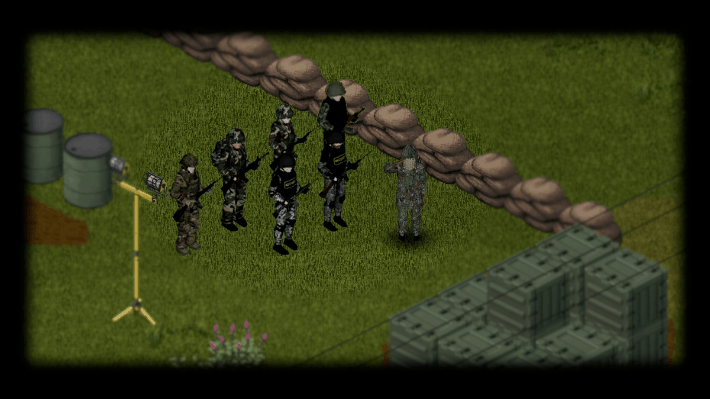 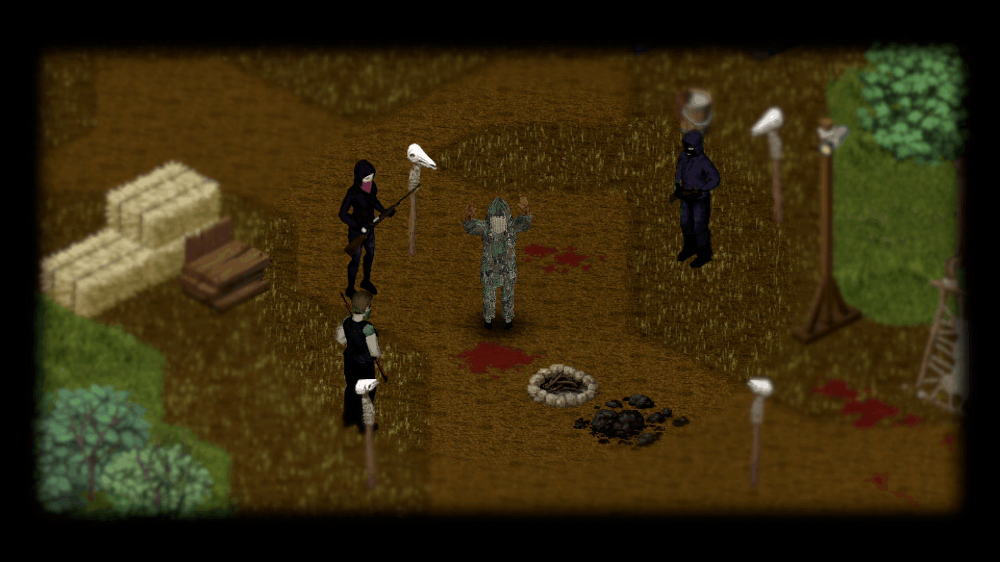 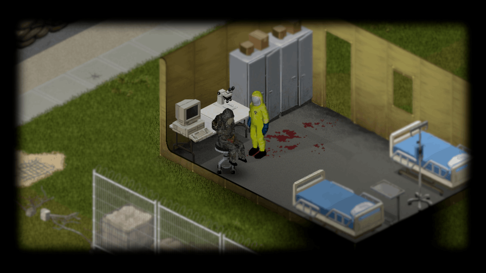 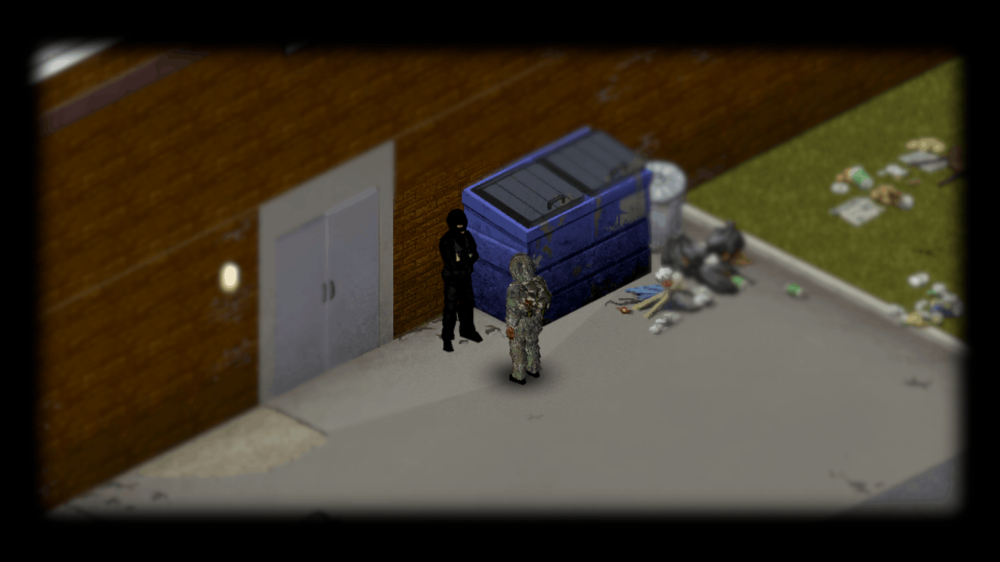 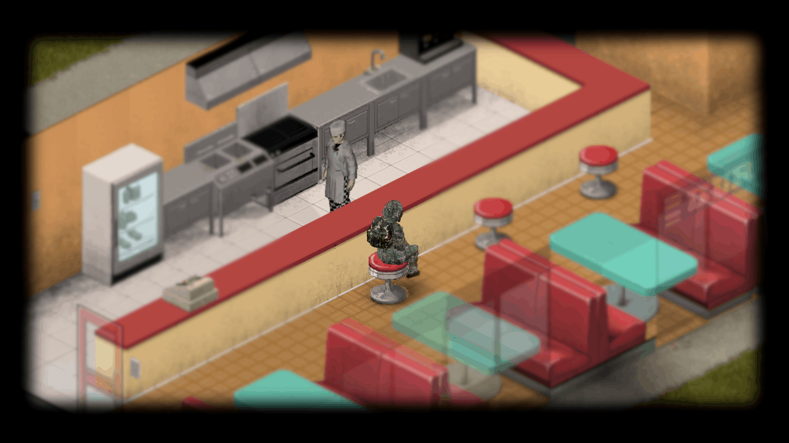 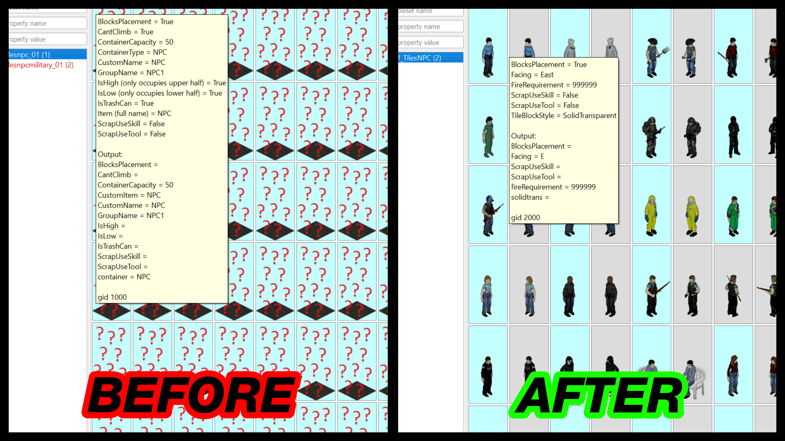
</div>

## Features

- Placeable static Human NPC tiles via a right-click context menu
- Option to 'Remove NPC Tile' via a right-click context menu
- Container variant (50 Storage Capacity) alongside the plain decorative Tiles
- Standard NPC and Military NPC texture packs
- Tile picker window with a scrollable sprite grid for choosing which figure to place
- Ability to choose and change Container NPC Icon
- Configuirable Container Capacity (1-10000)
- Griefer Proof Tiles (Cannot be set on fire, dismantled, picked up, Sledgehammered or destroyed)
- Multi-Language Support. Translations Available: AR, CA, CH, CN, CS, DA, DE, EN, ES, FI, FR, HU, ID, IT, JP, KO, NL, NO, PH, PL, PT, PTBR, RO, RU, TH, TR, UA

## Installation

**Singleplayer:** Subscribe to the Mod on Steam Workshop and enable it from the 'Choose Mods' screen.

**Multiplayer (Hosted & Dedicated):** Subscribe to the Mod on Steam Workshop and add the below lines to your Server's .ini file

```ini
Mods=[B42]NPCTiles
WorkshopItems=3759853561
```

## How It Works

Right-click a tile in the world to bring up **Place NPC Tile** or **Place NPC Container Tile** in the context menu. This opens a picker window showing every available sprite in a scrollable grid. Click one to place it at the target square. If 'Place NPC Container Tile' was selected, a secondary picker window appears allowing the user to select a Container Icon to use.

Container Icons can be changed by right-clicking on the NPC Tile and selecting 'Change NPC Container Icon'.

Once placed, a Tile is protected from fire, being dismantled, picked up, destroyed or Sledgehammered.

To remove an NPC Tile, right-click on the NPC Tile and select **Remove NPC Tile** from the context menu.

!!! note "Multiplayer Placement is gated by Admin permissions"
    
    The context menu options only appear for Players with Admin access in Multiplayer.

## Compatibility

| Build |  SP | Hosted MP | Dedicated MP
|:---:|:---:|:---:|:---:|
| 42.0+ | ✅ | ✅ | ✅ |
| 41 | ❌ | ❌ | ❌ |

!!! note "Multiplayer Capacity Support"

    Capacities 1-100 supported fully. For capacities 100-10000, 'Multiplayer Weight Limit Breaker' (Workshop ID: 3641432632) is required to function correctly. Singleplayer unaffected and functions correctly with Capacities 1-10000 out of the box.

## FAQ / Troubleshooting

!!! question "I don't see the 'Place NPC Tile' option in my context menu."

    In Multiplayer, only Players with Admin access can place tiles. Check your permissions, or try in Singleplayer.

## Credits

- Original Mod and Sprites by [Destiny](https://steamcommunity.com/id/destinyy55) and [Vass](https://steamcommunity.com/profiles/76561198003329839) — [Original Mod's Workshop Page](https://steamcommunity.com/sharedfiles/filedetails/?id=3344981715)

## Changelog

[:fontawesome-brands-steam-symbol: View Patch Notes](https://steamcommunity.com/sharedfiles/filedetails/changelog/3759853561)
