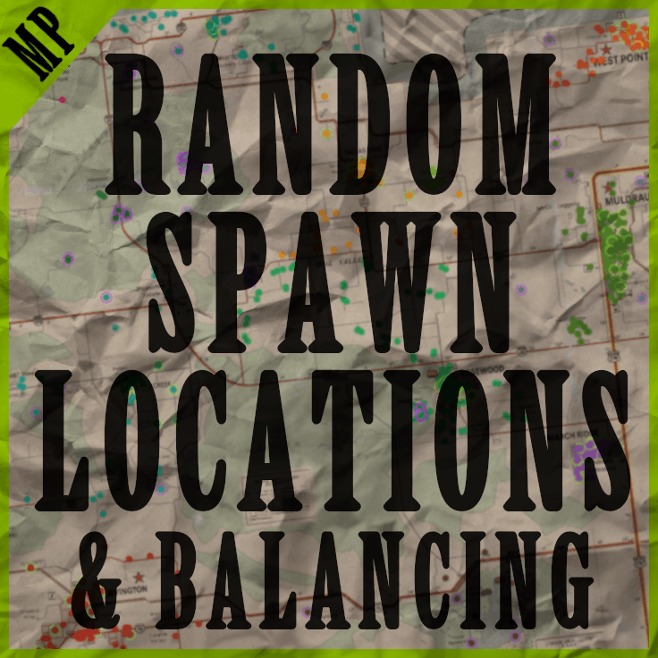

# **Random Spawn Locations**

<div class="mod-hero" markdown>

{ .mod-icon }

<span class="pz-tag">B42</span><span class="pz-tag">MP</span>

*Replaces vanilla spawn choices with a single, curated "Random Spawn" option.*

**Build:** 42.15+ | **SP/MP:** Multiplayer / Dedicated Server only (not Singleplayer)

[:fontawesome-brands-steam-symbol: Steam Workshop](#) · [RSL Spawn Map](https://obnoxiouslynoxious.github.io/RSLMapProject/) · [RSL Spawn Index](https://docs.google.com/spreadsheets/d/1ZaW1JDPTXN_U8sBjgZKKLwKkwf4NZwS23TsA0I3B_64/edit?gid=0#gid=0)

</div>

## Overview

Random Spawn Locations replaces every vanilla spawn choice with a single **"Random Spawn, KY"** option. Players are placed at a random coordinate drawn from a curated pool of thousands of verified spawn points across Knox County — occupation is ignored, so every profession draws from the same pool. The spawn coordinate pool is **server-side only** and never sent to clients.

## Gallery

<!--
<div class="gallery-grid" markdown>
 
</div>
-->

## Features

- Single "Random Spawn, KY" entry replaces the entire vanilla spawn screen
- Thousands of hand-verified spawn points across Knox County
- **Balanced** preset spreads spawns evenly across all vanilla towns
- Fine-grained control: toggle individual towns, and Residential / Non-Residential / Hardcore / Isolated location types
- Optional support for modded maps (Maplewood, Raven Creek, AnruisiTown) and Indiana map expansions
- Custom spawn points can be added by editing the server-side spawnpoints file

## Installation

This is a **server-side mod** — the server host configures it, and all connecting players must also subscribe on Steam Workshop.

=== "Step 1 — Subscribe"

    Subscribe to **[B42] Random Spawn Locations [MP]** on Steam Workshop. If your server also runs a supported modded map, subscribe to that too:

    - Maplewood [B42] — Workshop ID `3644794945`
    - Raven Creek (B42) — Workshop ID `3484263516`
    - AnruisiTown (Military Bastion) — Workshop ID `3659676359`

    All connecting players must be subscribed to the same map mods as the server.

=== "Step 2 — Server .ini"

    Edit your server `.ini`:

    ```
    Windows: C:\Users\<YourName>\Zomboid\Server\<ServerName>.ini
    Linux:   /home/<user>/Zomboid/Server/<ServerName>.ini
    ```

    ```ini
    Mods=RandomSpawnLocations
    Map=Random Spawn, KY;Muldraugh, KY
    SpawnPoint=0,0,0
    ```

    With modded maps, `RandomSpawnLocations` must be first in `Mods=`, and `Random Spawn, KY` must be first in `Map=` with `Muldraugh, KY` last:

    ```ini
    Mods=RandomSpawnLocations;RavenCreekB42;AnruisiTown;Maplewood
    Map=Random Spawn, KY;RavenCreekB42;AnruisiTown;Maplewood;Muldraugh, KY
    ```

    !!! warning
        The server settings UI may overwrite your `.ini` when you save changes in-game. Keep a backup copy of your edited `.ini` elsewhere so you don't have to redo this.

=== "Step 3 — Spawnregions file"

    Create or edit `<ServerName>_spawnregions.lua` in `Zomboid/Server/` (must match your `.ini` filename exactly):

    ```lua
    function SpawnRegions()
        return {
            { name = "Random Spawn, KY", file = "media/maps/Random Spawn, KY/spawnpoints.lua" },
            { name = "Muldraugh, KY",    file = "media/maps/Muldraugh, KY/spawnpoints.lua" },
        }
    end
    ```

    !!! important
        Both entries are required — if `Muldraugh, KY` is missing, the spawn selection screen is skipped entirely.

=== "Step 4 — Start the server"

    Start the server, then open **Custom Sandbox** settings to configure the new **Random Spawn** tabs (see [Configuration](#configuration) below). Players will now see only **Random Spawn, KY** on the character creation screen.

## Configuration

Three sandbox tabs are added:

| Tab | Purpose |
|---|---|
| **Random Spawn - Presets** | `Balanced` (default, **on**) restricts spawns to a hand-picked, evenly-distributed pool across all vanilla towns. Disable it to fully customize which towns/types are used — be aware pool sizes vary a lot by location. |
| **Random Spawn - Locations** | Toggle individual vanilla towns on/off. Towns in the Balanced pool are enabled by default. |
| **Random Spawn - Map Mods** | Enable spawn points in supported modded map regions. All **disabled by default**. |

**Random Spawn - Types** (used only when `Balanced` is disabled):

| Option | Default | Description |
|---|---|---|
| Residential | OFF | Houses, apartments, farmhouses |
| Non-Residential | OFF | Businesses, offices, warehouses |
| Hardcore Spawns | OFF | Dangerous or challenging locations |
| Isolated Areas | OFF | Remote cabins, camps, rural hideaways |

Recommended for most servers: leave everything at default (Balanced enabled).

!!! tip
    Consider allowing players to spawn with a flashlight in their inventory, especially if you enable Non-Residential, Hardcore, or Isolated Areas spawn types.

### Adding custom spawn points

Open `RandomSpawn_spawnpoints.lua` in your server folder and add entries under **CUSTOM SPAWNS**:

```lua
{ worldX = 35, worldY = 31, posX = 113, posY = 9 },   -- your label here
```

Get coordinates from the [B42 Map](https://map.b42.org): `worldX`/`worldY` = Cell values, `posX`/`posY` = Rel values, `posZ` = floor (omit for ground level).

### Advanced: enabling Indiana map spawns

Indiana spawn files ship with the mod but are **inactive by default** and require both the Indiana map mod and manual Lua edits (adding sandbox options, translations, and spawn-loading entries across three files under `Contents/mods/RandomSpawnLocations/42/media/`). This is a source-level change, not a settings toggle — see the mod's `RSL_Indiana_ActivationGuide.md` for the exact file edits if you need this. Indiana spawns are not part of the Balanced pool and only appear once their town toggle is enabled under Map Mods.

## Compatibility

| Build |  SP | Hosted MP | Dedicated MP
|:---:|:---:|:---:|:---:|
| 42.15+ | ❌ | ✅ | ✅ |
| < 42.15 | ❌ | ❌ | ❌ |

Builds prior to 42.15 will have broken translations in Sandbox Settings — server and all clients must match the required build.

## FAQ / Troubleshooting

!!! question "Spawn screen is skipped entirely"

    Check that `<ServerName>_spawnregions.lua` has both the `Random Spawn, KY` and `Muldraugh, KY` entries.

!!! question "Both 'Random Spawn, KY' and 'Muldraugh, KY' appear on the spawn screen"

    The client UI hook isn't loading — confirm every player is subscribed and `RandomSpawnLocations` is in `Mods=`.

!!! question "Map doesn't load in Spawn Select / no description or video"

    `map.info` isn't being read — make sure `Random Spawn, KY` is first in `Map=` and the mod is loading.

!!! question "Players spawn outside buildings or in the ground"

    Check the server console for "spawn not in building" errors and report the IDs on the Workshop page.

!!! question "Sandbox option changes aren't taking effect mid-session"

    Sandbox filter changes made via the in-game Admin menu require returning to the main menu to apply. Changing these mid-session on a live server generally isn't recommended — configure before startup instead.

!!! question "Adding a modded map to an existing save"

    This may require a full save wipe — if players have already explored areas near the new map region, the world may not load correctly. Back up your save first (`Zomboid\Saves\Multiplayer\<ServerName>\` and `Zomboid\Server\<ServerName>_player.db`).

### Uninstalling

1. Remove `RandomSpawnLocations` from `Mods=` in your `.ini`
2. Remove `Random Spawn, KY` from `Map=` in your `.ini`
3. Delete `<ServerName>_spawnregions.lua` from `Zomboid/Server/`, or restore the vanilla version
4. Existing characters are unaffected — the save itself doesn't change

## Credits

- [RSL Spawn Map](https://obnoxiouslynoxious.github.io/RSLMapProject/) — view all spawn locations on an interactive map
- [RSL Spawn Index](https://docs.google.com/spreadsheets/d/1ZaW1JDPTXN_U8sBjgZKKLwKkwf4NZwS23TsA0I3B_64/edit?gid=0#gid=0) — full spreadsheet index of spawn locations

## Changelog

See the mod's Steam Workshop page for the full version history.
