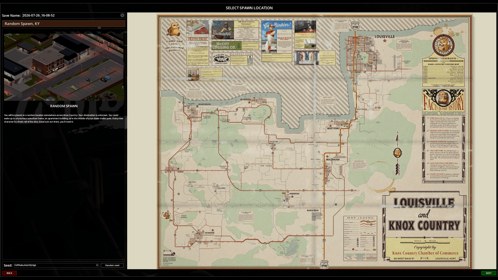
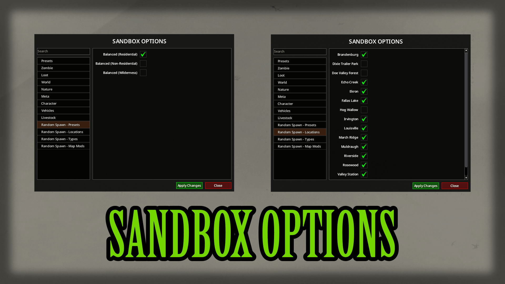
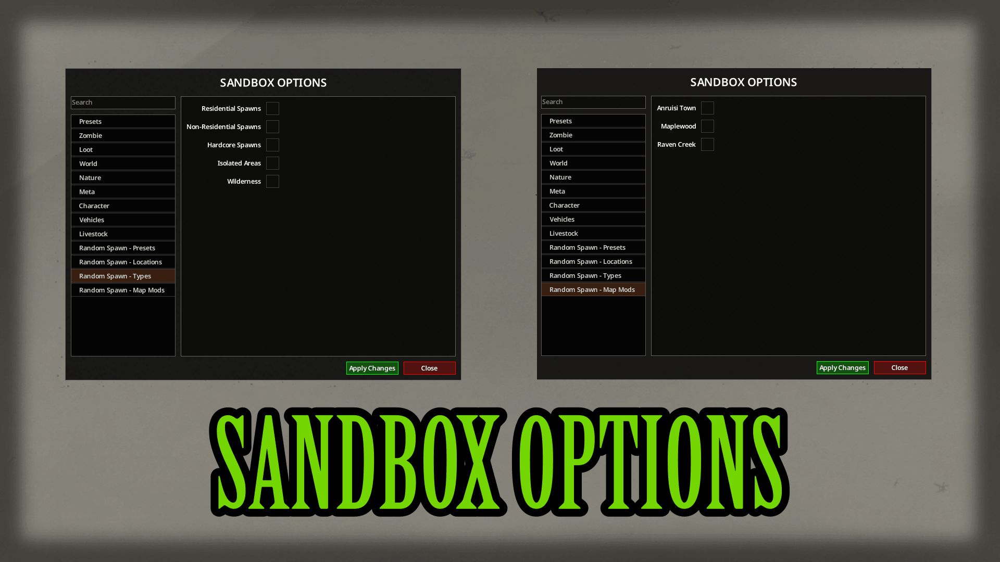
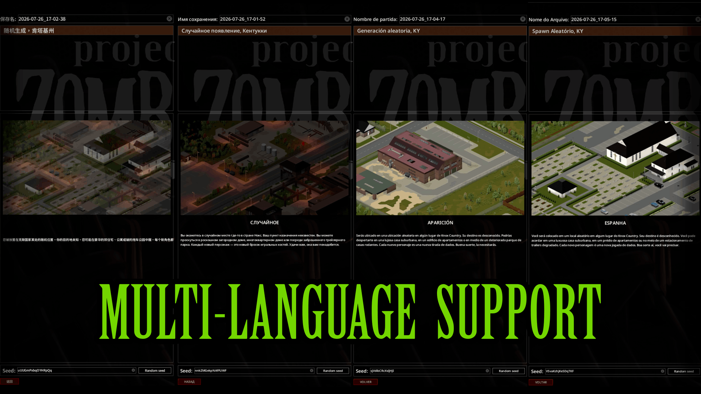
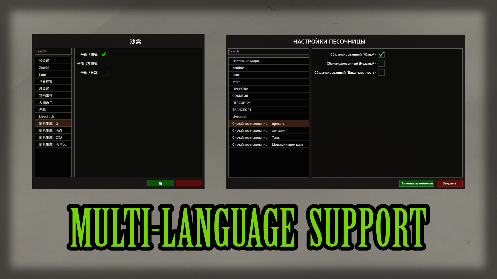
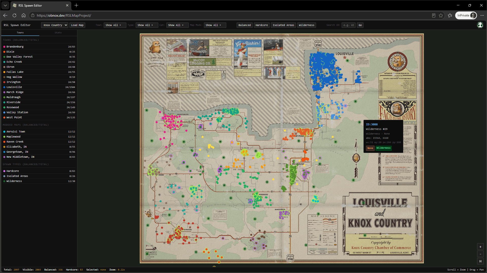

# **Random Spawn Locations**

<div class="mod-hero" markdown>

{ .mod-icon }

<span class="pz-tag">B42</span><span class="pz-tag">SP/MP</span>

[:fontawesome-brands-steam-symbol: Steam Workshop](https://steamcommunity.com/sharedfiles/filedetails/?id=3730705272)

**Recommended Build:** 42.15+

</div>

## Overview

Replaces all Vanilla spawn choices with a single **"Random Spawn, KY"** option. Each new character spawns at a randomly selected location drawn from a curated pool of thousands of verified spawn points spread across Knox Country. No two characters are guaranteed to start in the same place. Includes a 'Balanced' option to ensure players have equal chances of spawning in each Town.

## Resources

[**Random Spawn Location Interactive Map:**](https://obnox.dev/RSLMapProject/)
[**Random Spawn Locations Index/Spreadsheet**](https://obnox.dev/RSLSheet/)

## Gallery

<div class="gallery-grid" markdown>
     
</div>

## Features

- Single "Random Spawn, KY" entry replaces the vanilla PZ Locations in the 'Select Spawn Location' screen
- Thousands of hand-verified spawn points across Knox Country
- Balanced preset spreads Spawns evenly across all Vanilla towns
- Fine-grained control: Toggle individual Towns, Residential / Non-Residential / Hardcore / Isolated / Wilderness location types
- Optional support for modded maps (Maplewood, Raven Creek, AnruisiTown) and Indiana map expansions
- UI and Sandbox Translations for all Supported Project Zomboid Languages

## How It Works

When a Player creates a new Character, they are presented with a single **Random Spawn** option. The Mod selects one coordinate at random from the active Spawn pool and places the Player there. All professions draw from the same pool.

The spawn pool is filtered based on the server's Sandbox Options before any coordinate is sent to the Client. The full point list is never transmitted to Clients in Multiplayer.

## Installation

**Singleplayer:** Subscribe to the Mod on Steam Workshop and enable it from the 'Choose Mods' screen.

**Multiplayer:**

=== "Step 1 — Subscribe"
    
    Subscribe to **[B42] Random Spawn Locations [MP]** on Steam Workshop. If your server also runs a supported modded map, subscribe to that too:
    
    !!! note "Modded Maps"
            
        ```
        - Maplewood [B42] — Workshop ID `3644794945`
        - Raven Creek (B42) — Workshop ID `3484263516`
        - AnruisiTown (Military Bastion) — Workshop ID `3659676359`
        ```

    All connecting Clients must be subscribed to the same Map Mods as the Server.

=== "Step 2 — Server .ini"

    Edit your server `.ini`:

    !!! note "Location:"

        ```
        Windows: C:\Users\<YourName>\Zomboid\Server\<ServerName>.ini
        Linux:   /home/<user>/Zomboid/Server/<ServerName>.ini
        ```

    !!! note "<ServerName>.ini"

        ```ini
        Mods=RandomSpawnLocations
        WorkshopItems=3730705272
        Map=Random Spawn, KY;Muldraugh, KY
        SpawnPoint=0,0,0
        ```

    With modded maps, `RandomSpawnLocations` must be first in `Mods=`, and `Random Spawn, KY` must be first in `Map=` with `Muldraugh, KY` last:

    !!! note "Example:"

        ```ini
        Mods=RandomSpawnLocations;RavenCreekB42;AnruisiTown;Maplewood
        Map=Random Spawn, KY;RavenCreekB42;AnruisiTown;Maplewood;Muldraugh, KY
        ```

    !!! warning
        The Server Settings UI may overwrite your `.ini` when you save changes in-game. Keep a backup copy of your edited `.ini` elsewhere so you don't have to redo this.

=== "Step 3 — SpawnRegions File"

    !!! note "SpawnRegions File"
    
        Create or edit `<ServerName>_spawnregions.lua` in `Zomboid/Server/` (must match your `.ini` filename exactly):

        ```lua
        function SpawnRegions()
            return {
                { name = "Random Spawn, KY", file = "media/maps/Random Spawn, KY/spawnpoints.lua" },
                { name = "Muldraugh, KY",    file = "media/maps/Muldraugh, KY/spawnpoints.lua" },
            }
        end
        ```

    !!! important
        Both entries are required. `Muldraugh, KY` must be present or the spawn selection screen is skipped entirely.

=== "Step 4 — Start the server"

    !!! note "Start the Server"

        Start the server, then open **Custom Sandbox** settings (or edit the '<ServerName>_SandboxVars.lua' file) to configure the **Random Spawn** tabs (see [Configuration](#configuration) below). Players will now see only **Random Spawn, KY** on the 'Select Spawn Location' screen.

## Configuration

All settings are found under the **Random Spawn** tabs in the Custom Sandbox options screen.

### Random Spawn - Presets

| Setting | Default | Description |
|:---:|:---:|:---|
| Balanced (Residential) | `On` | Restricts the spawn pool to a hand-picked set of locations, with an equal number (currently 12 per location) of verified spawn points across each of the 12 supported locations. Recommended for most servers. |
| Balanced (Non-Residential) | `Off` | A curated balanced pool of non-residential spawn points, mirroring the existing Balanced Residential preset. |
| Balanced (Wilderness) | `Off` | A curated balanced pool of Wilderness spawn points for servers wanting a more isolated experience with even geographic distribution. |

Disabling one of the below listed Towns in 'Random Spawn - Locations' will remove it from the Balanced pool. Enabling a Town not listed below will have no effect while Balanced is selected. Map Mods can be Enabled while Balanced is selected and they will be added to the Balanced pool.

### Random Spawn - Locations

Toggle individual vanilla towns on or off. Towns included in the Balanced pool are enabled by default.

**Supported locations:** Brandenburg, Dixie, Doe Valley Forest, Echo Creek, Ekron, Fallas Lake, Hog Wallow, Irvington, Louisville, March Ridge, Muldraugh, Riverside, Rosewood, Valley Station, West Point

### Random Spawn - Types

| Option | Default | Description |
|:---:|:---:|:---|
| Residential | `Off` | Houses, apartments, trailers, farmhouses |
| Non-Residential | `Off` | Businesses, warehouses, offices, civic buildings |
| Hardcore Spawns | `Off` | Dangerous or challenging locations |
| Isolated Areas | `Off` | Remote cabins, camps, rural hideaways |
| Wilderness | `Off` | Open wilderness areas with no nearby buildings |

### Random Spawn - Map Mods

Enable spawn points in supported modded map regions. All are **disabled by default**.

| Map Mod | Workshop ID |
|:---:|:---:|
| Maplewood [B42] | `3644794945` |
| Raven Creek (B42) | `3484263516` |
| AnruisiTown (Military Bastion) | `3659676359` |

!!! tip
    Consider allowing players to spawn with a flashlight in their inventory, especially if you enable Non-Residential, Hardcore, or Isolated Areas spawn types.

If all filters produce zero valid results, the mod automatically falls back to the Balanced Residential pool to prevent spawn failures.

## Compatibility

| Build | SP | Hosted MP | Dedicated MP |
|:---:|:---:|:---:|:---:|
| 42 | ✅ | ✅ | ✅ |
| 41 | ❌ | ❌ | ❌ |

!!! success "Is this Mod safe to add/remove to existing Saves?"

    Yes, it is safe to add to or remove from existing saves (existing characters are unaffected).

!!! success "Is this Mod compatible with 'X' Mod?"

    May conflict with other Mods that modify the 'Choosepawn selection screen or `spawnpoints.lua`. Does not affect players respawning in Safehouses.

!!! success "Does this Mod support 'X' Language?"

    Yes, this Mod has translations for all Supported Project Zomboid languages.

## FAQ / Troubleshooting

!!! question "Why is the 'Select Spawn Location' screen skipped entirely"

    Check that `<ServerName>_spawnregions.lua` has both the `Random Spawn, KY` and `Muldraugh, KY` entries.

!!! question "Why am I seeing both 'Random Spawn, KY' and 'Muldraugh, KY' appear on the 'Select Spawn Location' screen?"

    The Client UI hook isn't loading. Confirm every player is subscribed and `RandomSpawnLocations` is in `Mods=`.

!!! question "Map doesn't load in Spawn Select / no description or video"

    `map.info` isn't being read. Ensure `Random Spawn, KY` is first in `Map=` and the mod is loading.

!!! question "Players spawn outside buildings or in the ground"

    Check the server console for "Spawn not in building" errors and report the IDs on the Workshop page or in Nox's Discord Server.

!!! question "Sandbox Option changes aren't taking effect mid-session"

    Sandbox filter changes made via the in-game Admin menu require a Server restart to apply. Changing these mid-session on a live server generally isn't recommended. Configure before startup instead.

!!! question "How do I add a modded map to an existing save"

    This may require a full save wipe. If players have already explored areas near the new map region, the world may not load correctly. Back up your save first (`Zomboid\Saves\Multiplayer\<ServerName>\` and `Zomboid\Server\<ServerName>_player.db`).

### Uninstalling

1. Remove `RandomSpawnLocations` from `Mods=` in your `.ini`
2. Remove `Random Spawn, KY` from `Map=` in your `.ini`
3. Delete `<ServerName>_spawnregions.lua` from `Zomboid/Server/`, or restore the vanilla version
4. Existing characters are unaffected — the save itself doesn't change

## Credits

- A huge thank you to **Pillow** — ([Pillow's Random Spawns](https://steamcommunity.com/sharedfiles/filedetails/?id=1911132112)) — for making their extensive spawn location data openly available under the [GNU General Public License v3.0](https://github.com/crispiboi/Pillow-s-Many-Spawns-Pack). The spawn pool in this mod is built upon their incredible work curating thousands of verified spawn points across Knox Country.
- [RSL Spawn Map](https://obnoxiouslynoxious.github.io/RSLMapProject/) — view all spawn locations on an interactive map
- [RSL Spawn Index](https://docs.google.com/spreadsheets/d/1ZaW1JDPTXN_U8sBjgZKKLwKkwf4NZwS23TsA0I3B_64/edit?gid=0#gid=0) — full spreadsheet index of spawn locations

This Mod is open source and available under the [GNU General Public License v3.0](https://github.com/ObnoxiouslyNoxious/RandomSpawnLocations-MP-/blob/main/LICENSE).

## Changelog

[:fontawesome-brands-steam-symbol: View Patch Notes](https://steamcommunity.com/sharedfiles/filedetails/changelog/3730705272)
