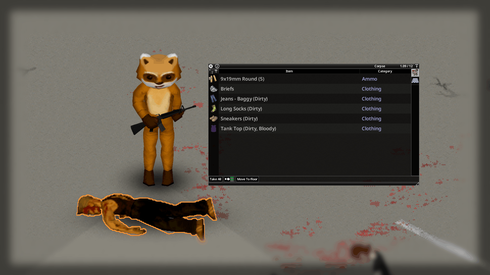
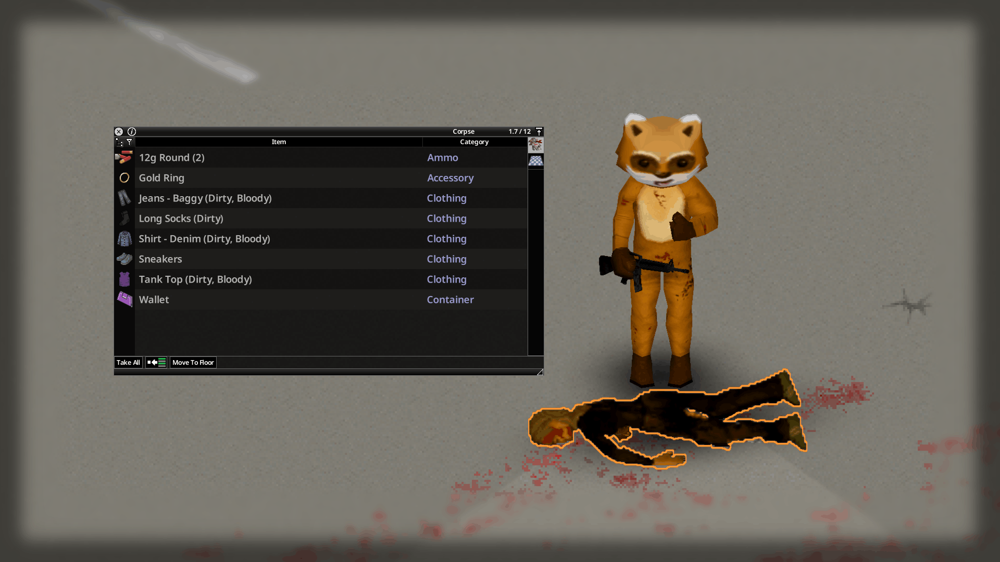
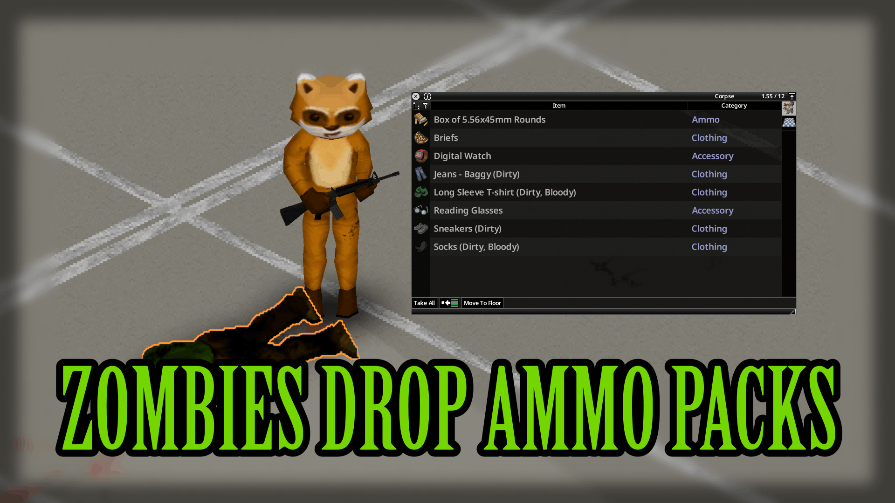
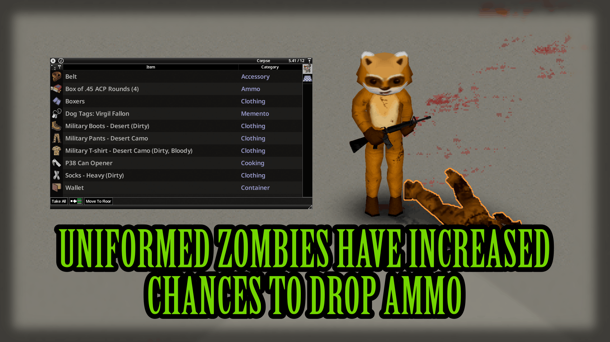
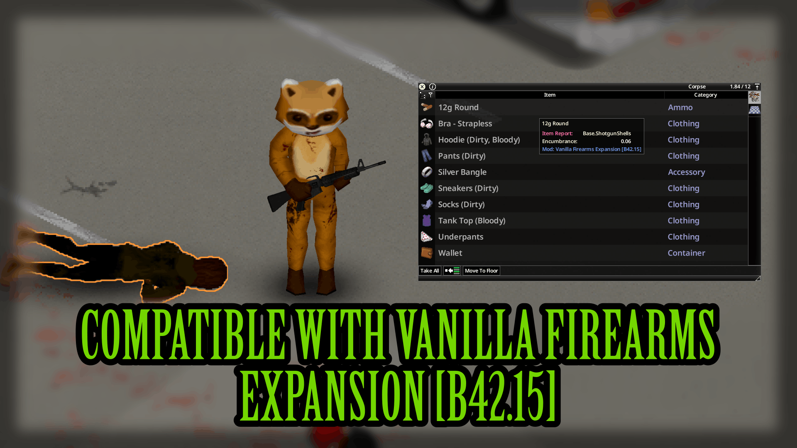
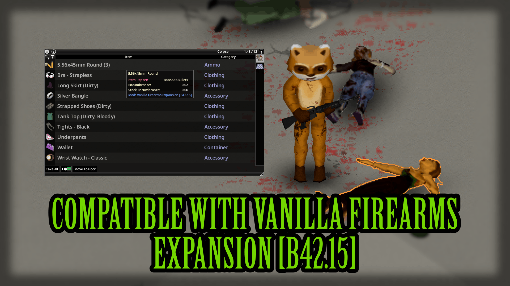
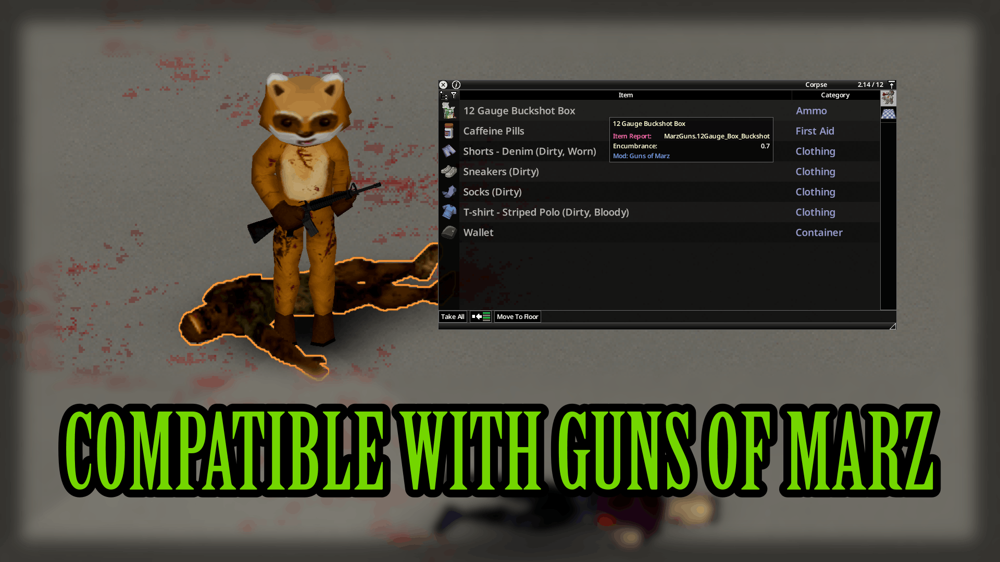
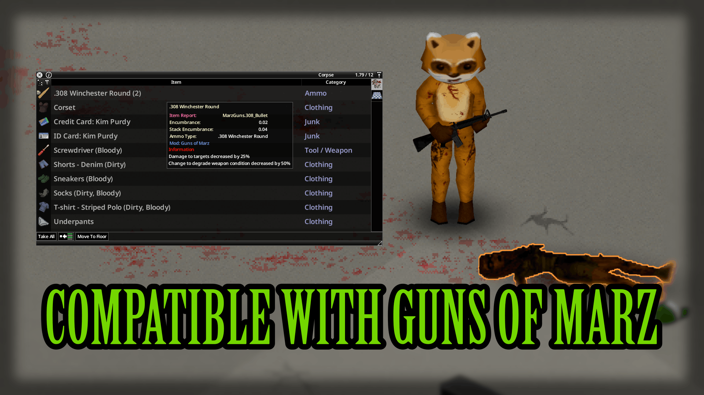
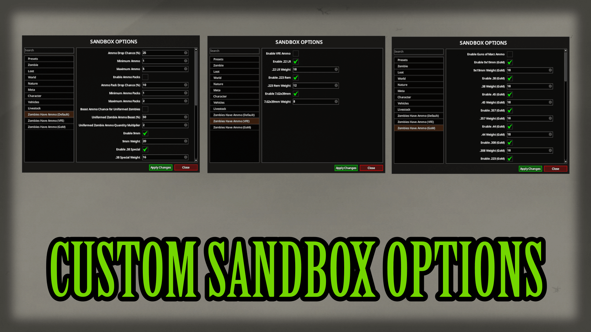
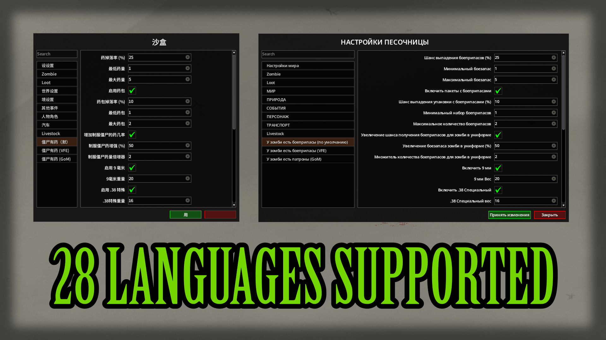

# **Zombies Have Ammo**

<div class="mod-hero" markdown>

{ .mod-icon }

<span class="pz-tag">B42</span><span class="pz-tag">SP/MP</span>

[:fontawesome-brands-steam-symbol: Steam Workshop](https://steamcommunity.com/sharedfiles/filedetails/?id=3728283972)

**Recommended Build:** 42.15+

</div>

## Overview

Adds a configurable chance for Zombies to drop loose Ammo on death, on top of vanilla drop behaviour. Also adds Sandbox Options to Enable Zombies dropping Boxed Ammo, and Uniformed Zombies to have increased chances and amounts of Ammo dropped.

## Gallery

<div class="gallery-grid" markdown>
         
</div>

## Features

- Configurable chance for Zombies to drop loose Ammo or Ammo boxes.
- Includes Support for Vanilla Firearms Expansion [B42.15] & Guns of Marz.
- Includes a weighted Rarity System. Common Calibres (9mm, .38, .45) appear more often than rare ones (.44 Magnum).
- Independent Enable + Weight setting for every Vanilla Calibre, VFE Calibre & GoM Calibre.
- Optional Ammo pools for Vanilla Firearms Expansion (3 Calibres) and Guns of Marz (26 Calibres), each independently toggleable.
- Fully server-side spawning, preventing duplication or desync.

## How It Works

Every Zombie death triggers a single Ammo Roll.

- If the roll fails, nothing drops.
- If the roll succeeds, the Zombie drops either loose rounds or an Ammo Box, never both.
- A second roll determines loose vs Box (if Ammo Packs are enabled).
- Ammo type is chosen using a weighted rarity table, ensuring common calibres appear more often than rare ones.
- Every calibre has its own Enable/Weight option for fine-tuned control.
- Zombies wearing Military, Police, Ranger, or Militia outfits have an increased chance to drop Ammo when the Uniformed Zombie Boost is enabled.

The drop rolls only on the server, preventing item duplication and desync in multiplayer.

## Installation

**Singleplayer:** Subscribe to the Mod on Steam Workshop and enable it from the 'Choose Mods' screen.

**Multiplayer (Hosted & Dedicated):** Subscribe to the Mod on Steam Workshop and add the below lines to your Server's .ini file

```ini
Mods=ZombiesHaveAmmo
WorkshopItems=3728283972
```

For VFE or Guns of Marz support, subscribe to and load those Mods as well, then enable their pools in the Zombies Have Ammo (VFE)/Zombies Have Ammo (GoM) Sandbox Settings.

```
Mod ID: VFExpansionReduxb42
Workshop ID: 3611718925
```
```
Mod ID: MarzGuns
Workshop ID: 3722134990
```

## Configuration

Settings live under the **Zombies Have Ammo** tab, split into three sub-tabs.

**Zombies Have Ammo (Main)**

| Setting | Default | Range | Description |
|:---:|:---:|:---:|:---:|
| Ammo Drop Chance | 25% | 0–100% | Chance a zombie drops Ammo on death |
| Minimum / Maximum Ammo | 1 / 5 | 1–100 | Range of rounds/Boxes dropped |
| Enable Ammo Packs | Off | On/Off | Allows a Box drop instead of loose rounds |
| Ammo Pack Drop Chance | 10% | 0–100% | Of the times Ammo drops, chance it's a Box (not an independent roll) |
| Minimum / Maximum Ammo Packs | 1 / 1 | 1–20 | Range of Boxes dropped when a Pack drop occurs |
| Uniformed Zombie Boost | Off | On/Off | Zombies wearing Military, Police, Ranger, or Militia outfits have an increased chance to drop Ammo when the Uniformed Zombie Boost is enabled. |
| Uniformed Zombie Ammo Boost (%) | 50% | 0-100% | Chance a Uniformed Zombie drops Ammo (Additive % - Adds on top of Ammo Drop Chance (25% + 50% = 75% as Default)) |
| Uniformed Zombie Ammo Quantity Multiplier | 2x | 0-100 | Multiplier applied to Uniformed Zombie Ammo Drops (If Default rolls 2 Boxes, Uniformed Zombie will drop 4 Boxes) |

**Vanilla Ammo Weight**

| Calibre | Weight |
|:---:|:---:|
| 9mm | 20 |
| .38 Special | 16 |
| .45 ACP | 14 |
| 12g Shells | 14 |
| .30-30 | 12 |
| 5.56x45mm | 10 |
| 7.62x51mm (.308) | 6 |
| .357 Magnum | 4 |
| .44 Magnum | 2 |


**Zombies Have Ammo (VFE)** 
!!! note
    
    Requires Vanilla Firearms Expansion Redux (`VFExpansionReduxb42`) active. Set to 'Off' by Default.

| Calibre | Weight |
|:---:|:---:|
| .22 LR | 18 |
| .223 | 12 |
| 7.62x39mm | 8 |


**Zombies Have Ammo (GoM)** 
!!! note
    
    Requires Guns of Marz (`MarzGuns`) active. Set to 'Off' by Default.

| Calibre | Weight |
|:---:|:---:|
| 9x19mm | 18 |
| .38 | 18 |
| .45 | 18 |
| .357 | 18 |
| .44 | 18 |
| .308 | 18 |
| .223 | 18 |
| .30-30 | 18 |
| 12g Buckshot | 18 |
| 7.62x51mm | 9 |
| 5.56x45mm | 9 |
| .50 AE | 9 |
| 7.62x39mm | 9 |
| 5.45x39mm | 9 |
| 7.62x54mm | 9 |
| .45-70 | 5 |
| 9x39mm | 5 |
| .30-06 | 5 |
| 12g Slug | 5 |
| 5.56 HP | 2 |
| 5.56 AP | 2 |
| 5.56 Subsonic | 1 |
| 40mm Buckshot | 1 |
| 40mm HE | 1 |
| 40mm Incendiary | 1 |
| 5.56 Overpressured | 1 |

## Compatibility

| Build |  SP | Hosted MP | Dedicated MP
|:---:|:---:|:---:|:---:|
| 42 | ✅ | ✅ | ✅ |
| 41 or earlier | ❌ | ❌ | ❌ |

!!! question "Is this Mod safe to add/remove to existing Saves?"
    
    Yes, it is safe to add to existing saves and safe to remove, though any Ammo already looted from Zombies will remain in your save.

!!! question "Is this Mod compatible with 'X' Mod?"

    Yes, compatible with all other loot mods. Does not modify any existing loot tables or distributions.

!!! question "Does this Mod support 'X' Language?"

    Yes, this Mod has translations for all 28 Supported Project Zomboid languages.

## FAQ / Troubleshooting

!!! question "I enabled VFE/Guns of Marz Ammo but I'm not seeing those calibres drop."

    Make sure the source Mod (VFE or Guns of Marz) is actually active in your Mod list ([Refer to Installation](https://obnox.dev/NoxDocs/mods/zombies-have-ammo/#installation)), and that both the pool's master toggle and the individual calibre's Enable toggle are on.


## Changelog

[:fontawesome-brands-steam-symbol: View Patch Notes](https://steamcommunity.com/sharedfiles/filedetails/changelog/3728283972)