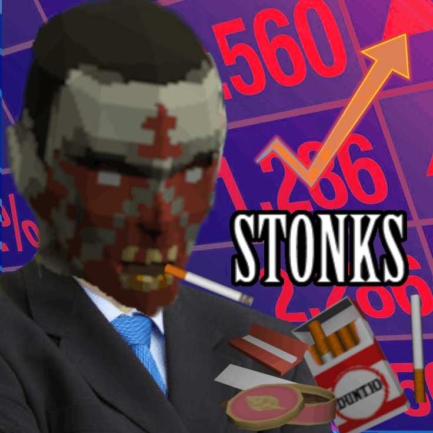

# **Zombies Have Smokes**

<div class="mod-hero" markdown>

{ .mod-icon }

<span class="pz-tag">B42</span><span class="pz-tag">SP/MP</span>

[:fontawesome-brands-steam-symbol: Steam Workshop](https://steamcommunity.com/sharedfiles/filedetails/?id=3728443049)

**Recommended Build:** 42.15+

</div>

## Overview

Gives zombies a chance to carry cigarettes, lighters, tobacco, cigars, and cigarillos when they die, on top of vanilla drop behavior. Every setting is configurable via Sandbox Options, and all item spawning is handled server-side only to prevent duplication and desync in multiplayer.

## Gallery

<!--
<div class="gallery-grid" markdown>
 
</div>
-->

## Features

- Cigarettes (loose Singles or full Packs), Cigarette Cartons, Cigars, Cigarillos, Chewing Tobacco, and Tobacco Pouches can all drop from zombies
- Every drop type has its own independent enable/disable toggle and drop-chance setting
- Cigars, Cigarillos, and Tobacco Pouches always spawn with a Lighter or Matches alongside them
- Items spawn in randomized "used" condition for realism and balance
- Fully server-side spawning — no client-side drop logic, no duplication risk
- Sandbox translations for all 28 PZ-supported languages

## How It Works

Every zombie death runs through a series of independent rolls, in order. The **first roll to succeed** determines the drop — a zombie never receives items from more than one roll:

1. **Chewing Tobacco** — low-chance roll, skips everything below if it hits
2. **Tobacco Pouch + Rolling Papers** — only rolled if step 1 failed
3. **Cigarette Carton** — only rolled if steps 1–2 failed
4. **Cigar** (always with a Lighter/Matches) — only rolled if steps 1–3 failed
5. **Cigarillo** (always with a Lighter/Matches) — only rolled if steps 1–4 failed
6. **Cigarettes** — only rolled if steps 1–5 failed; a second roll decides Pack vs. loose Singles, and a Lighter/Matches is always added if anything drops

## Installation

Subscribe to the mod on Steam Workshop and add it to your mod list — no server-side files are required:

```ini
Mods=ZombiesHaveSmokes
```

## Configuration

All settings live under the **Zombies Have Smokes** tab in Custom Sandbox options.

| Setting | Default | Range | Description |
|---|---|---|---|
| Enable Cigarettes | On | On/Off | Master toggle for all cigarette drops (Singles, Packs) |
| Enable Cigarette Packs | On | On/Off | Allows the cigarette drop to be a Pack instead of loose Singles |
| Cigarette Drop Chance | 30% | 1–100% | Chance a zombie drops cigarettes on death |
| Cigarette Pack Chance | 15% | 1–100% | Chance the cigarette drop is a Pack rather than Singles |
| Minimum / Maximum Singles | 1 / 3 | 1–100 | Range of loose cigarettes dropped when the Pack roll fails |
| Enable Chewing Tobacco | On | On/Off | Zombies can drop Chewing Tobacco |
| Chewing Tobacco Drop Chance | 2% | 1–100% | Rolls independently of other drops |
| Enable Tobacco Pouch | On | On/Off | Zombies can drop a Pouch of Tobacco + Rolling Papers (+ Lighter/Matches) |
| Tobacco Pouch Drop Chance | 2% | 1–100% | Rolls independently of other drops |
| Enable Cigarette Cartons | Off | On/Off | Zombies can drop a full Cigarette Carton |
| Cigarette Carton Drop Chance | 1% | 1–100% | Rolls after the tobacco rolls |
| Enable Cigars | Off | On/Off | Zombies can drop a Cigar (+ Lighter/Matches) |
| Cigar Drop Chance | 2% | 1–100% | — |
| Enable Cigarillos | Off | On/Off | Zombies can drop a Cigarillo (+ Lighter/Matches) |
| Cigarillo Drop Chance | 3% | 1–100% | — |

!!! note
    If Minimum Singles is set higher than Maximum Singles by mistake, the mod silently swaps the two values to prevent a crash.

### Drop chances at default settings

| Step | Outcome | Chance |
|---|---|---|
| 1 | Chewing Tobacco drops | 2% |
| 2 | Tobacco Pouch (+ Rolling Papers + Lighter/Matches) drops | 2% |
| 3 | Cigarette Carton drops | 1% |
| 4 | Cigar (+ Lighter/Matches) drops | 2% |
| 5 | Cigarillo (+ Lighter/Matches) drops | 3% |
| 6 | Cigarette drop triggers | 30% |

When the cigarette roll (step 6) succeeds: **15%** chance of a Cigarette Pack (6–15 cigarettes remaining out of 20), **85%** chance of loose Singles (1–3). Any time cigarettes drop, a Lighter/Matches is added: ~33% Disposable Lighter (1–10 uses of 66), ~33% Zippo Lighter (1–10 uses of 32), ~33% Matches.

### Item ID reference

| Item | Game ID |
|---|---|
| Single Cigarette | `Base.CigaretteSingle` |
| Cigarette Pack | `Base.CigarettePack` |
| Cigarette Carton | `Base.CigaretteCarton` |
| Cigar | `Base.Cigar` |
| Cigarillo | `Base.Cigarillo` |
| Disposable Lighter | `Base.LighterDisposable` |
| Zippo Lighter | `Base.Lighter` |
| Matches | `Base.Matches` |
| Chewing Tobacco | `Base.TobaccoChewing` |
| Pouch of Tobacco | `Base.TobaccoLoose` |
| Rolling Papers | `Base.CigaretteRollingPapers` |

## Compatibility

| Build |  SP | Hosted MP | Dedicated MP
|:---:|:---:|:---:|:---:|
| 42 | ✅ | ✅ | ✅ |
| 41 or earlier | ❌ | ❌ | ❌ |

Compatible with other loot mods — does not modify any existing loot tables or distributions. Safe to add to an existing save; safe to remove (any smokes already looted will remain in the save).

## FAQ / Troubleshooting

!!! question "Will this duplicate items in multiplayer?"

    No — all spawning runs server-side only, so clients never run drop logic.

!!! question "I set Minimum Singles higher than Maximum Singles, will it crash?"

    No, the mod silently swaps the two values.

## Credits

- [Steam Workshop](#)

## Changelog

**v1.0.1**

- Added Cigars, Cigarillos, and Cigarette Cartons as independent drops with their own Sandbox Options
- Split the old combined Chewing Tobacco / Tobacco Pouch roll into two independent drops
- Added per-drop-type enable/disable toggles
- Tobacco Pouch now spawns a Lighter or Matches alongside it
- Added Sandbox translations for all 28 PZ-supported languages
- Performance optimizations; raised sandbox option minimums from 0 to 1 to prevent silent spawn failures

See the mod's Steam Workshop page for the full version history.
