# **Zombies Have Smokes**

<div class="mod-hero" markdown>

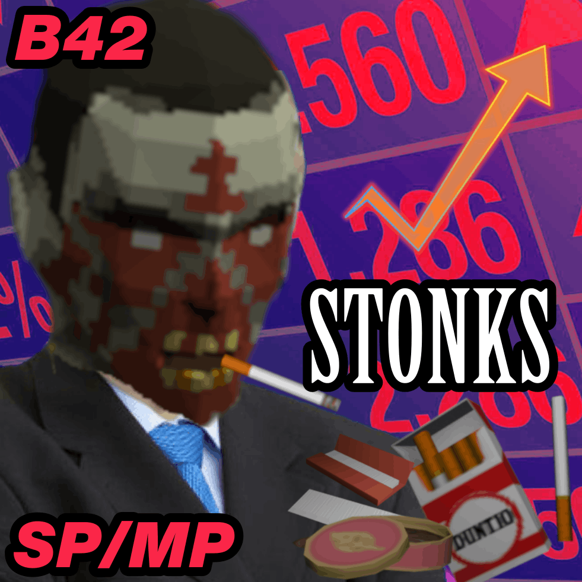{ .mod-icon }

<span class="pz-tag">B42</span><span class="pz-tag">SP/MP</span>

[:fontawesome-brands-steam-symbol: Steam Workshop](https://steamcommunity.com/sharedfiles/filedetails/?id=3728443049)

**Recommended Build:** 42.15+

</div>

## Overview

Adds a configurable chance for Zombies to drop Cigarettes, Lighters & Tobacco Products on death, on top of vanilla drop behaviour.

## Gallery

<div class="gallery-grid" markdown>
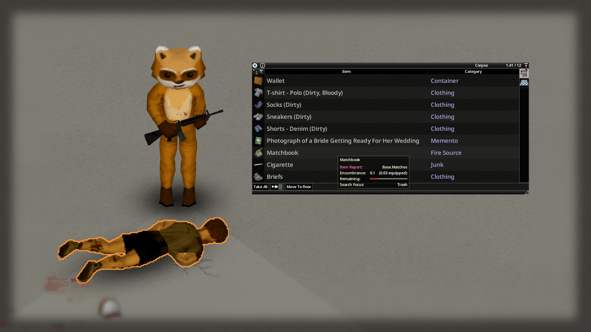 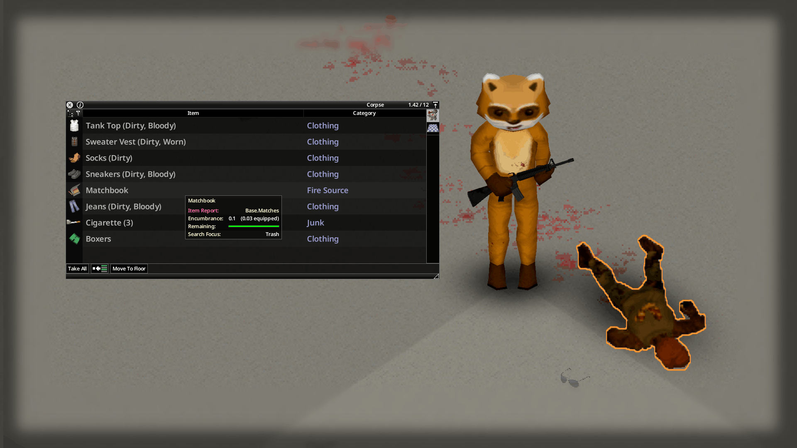 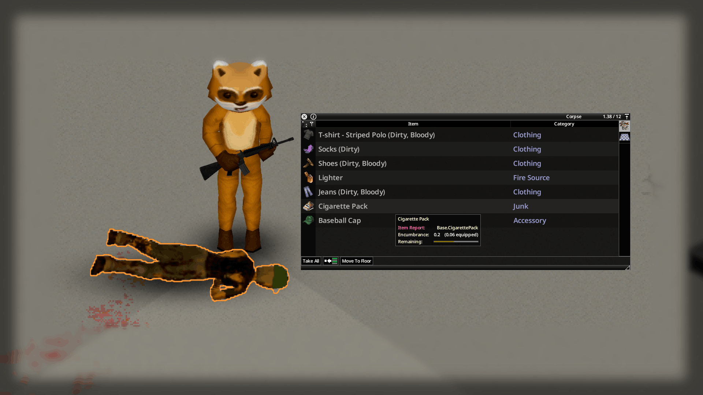 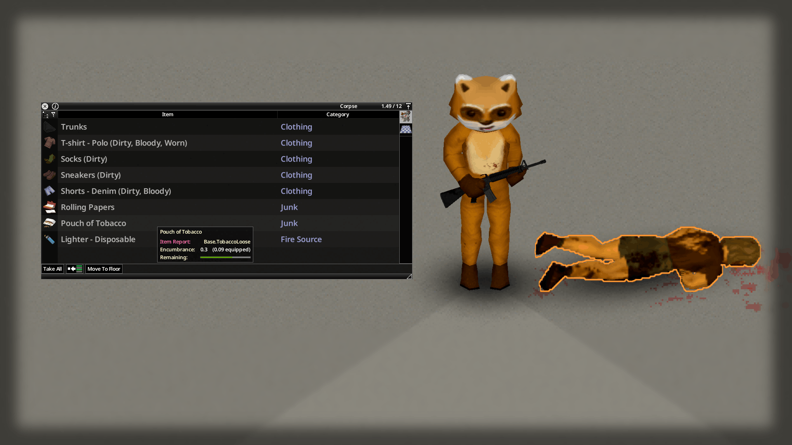 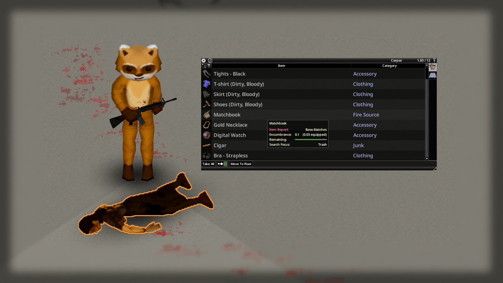 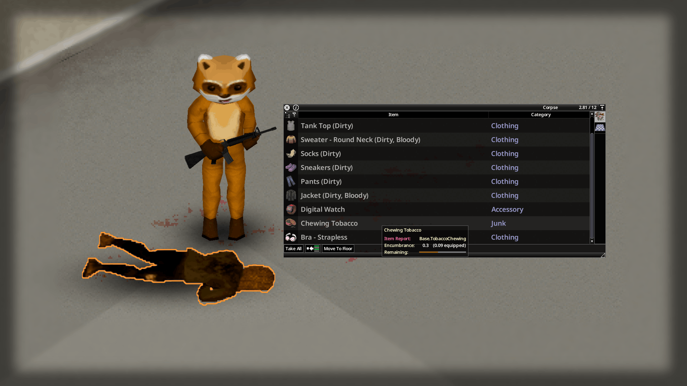 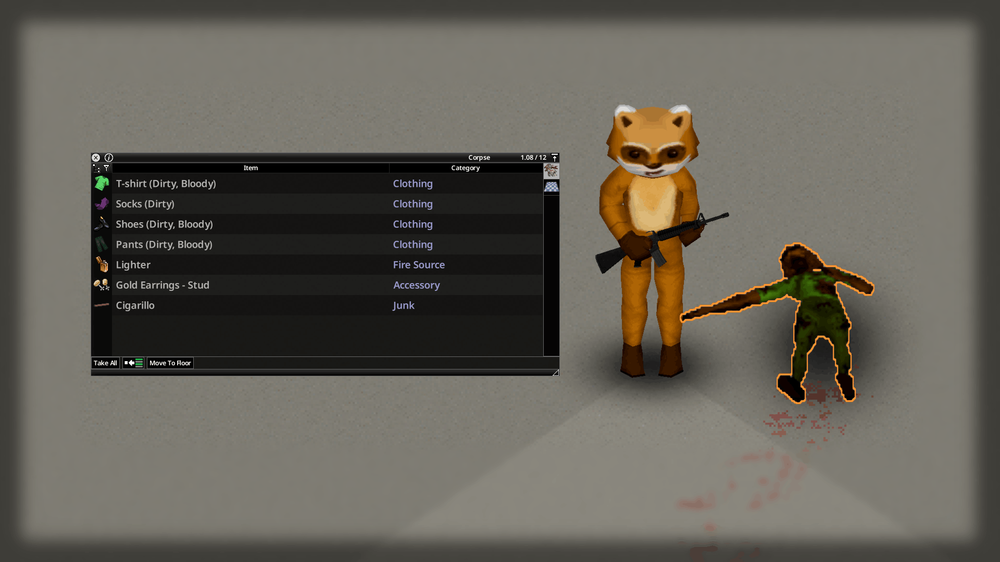 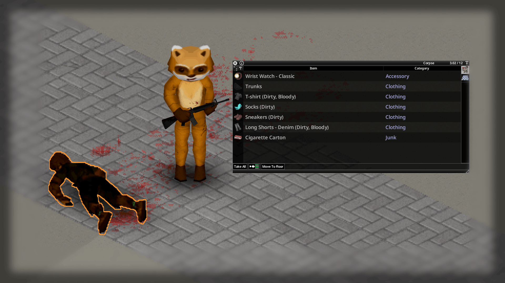 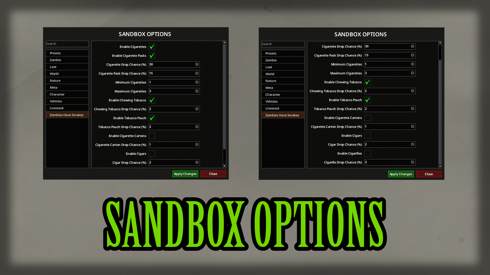 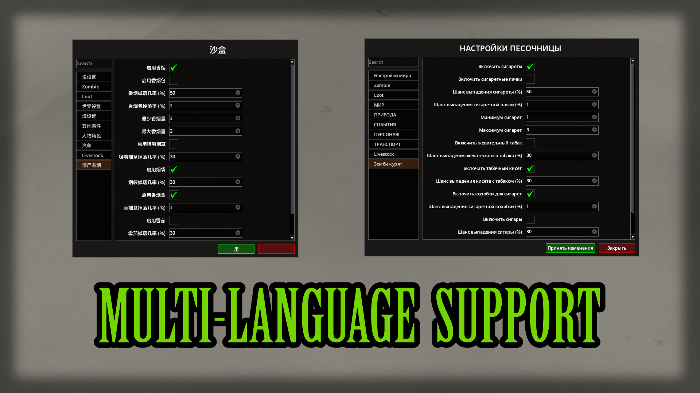
</div>

## Features

- Loose Cigarettes, Cigarette Packs, Cigarette Cartons, Cigars, Cigarillos, Chewing Tobacco, Tobacco Pouches (with Papers) and Lighters can all drop from Zombies
- Every drop type has its own independent Enable/Disable toggle and drop-chance settings
- All Tobacco items except for Chewing Tobacco & Cigarette Cartons spawn alongisde a Lighter
Cigarette Packs, Tobacco Pouches, Rolling Papers, Lighters and Matches all spawn in a 'used' condition, varying the amount of uses left on each drop for balancing and realism.
- All item spawning is handled server-side only. Clients do not run any drop logic, preventing duplication and inventory desync.
- Includes Translations for all Supported PZ Languages

## How It Works

Every Zombie death runs through a series of independent rolls in order. The first roll to succeed determines the drop. A Zombie will never receive items from multiple rolls.

Roll 1: Chewing Tobacco

Roll 2: Tobacco Pouch with Rolling Papers and a Lighter or Matches.

Roll 3: Cigarette Carton

Roll 4: Cigar with a Lighter or Matches.

Roll 5: Cigarillo with a Lighter or Matches.

Roll 6: Cigarettes — If this roll succeeds, a second roll determines whether the drop is a Cigarette Pack or loose Singles. A Lighter or Matches is always added alongside.

## Installation

**Singleplayer:** Subscribe to the Mod on Steam Workshop and enable it from the 'Choose Mods' screen.

**Multiplayer (Hosted & Dedicated):** Subscribe to the Mod on Steam Workshop and add the below lines to your Server's .ini file

```ini
Mods=ZombiesHaveSmokesB42
WorkshopItems=3728443049
```

## Configuration

All settings live under the **Zombies Have Smokes** tab in Custom Sandbox options.

| Setting | Default | Range | Description |
|:---:|:---:|:---:|:---:|
| Enable Cigarettes | On | On/Off | Master toggle for all Cigarette drops (Singles, Packs) |
| Enable Cigarette Packs | On | On/Off | Allows the Cigarette drop the chance to be a Pack instead of loose Singles |
| Cigarette Drop Chance | 30% | 1–100% | Chance a Zombie drops Cigarettes on death |
| Cigarette Pack Chance | 15% | 1–100% | Chance the Cigarette drop is a Pack rather than Singles |
| Minimum / Maximum Singles | 1 / 3 | 1–100 | Range of loose Cigarettes dropped when the Pack roll fails |
| Enable Chewing Tobacco | On | On/Off | Zombies can drop Chewing Tobacco |
| Chewing Tobacco Drop Chance | 2% | 1–100% | Rolls independently of other drops |
| Enable Tobacco Pouch | On | On/Off | Zombies can drop a Pouch of Tobacco + Rolling Papers (+ Lighter/Matches) |
| Tobacco Pouch Drop Chance | 2% | 1–100% | Chance a Zombie drops a Pouch of Tobacco on death |
| Enable Cigarette Cartons | Off | On/Off | Zombies can drop a full Cigarette Carton |
| Cigarette Carton Drop Chance | 1% | 1–100% | Chance a Zombie drops a Cigarette Carton on death |
| Enable Cigars | Off | On/Off | Zombies can drop a Cigar (+ Lighter/Matches) |
| Cigar Drop Chance | 2% | 1–100% | Chance a Zombie drops a Cigar on death |
| Enable Cigarillos | Off | On/Off | Zombies can drop a Cigarillo (+ Lighter/Matches) |
| Cigarillo Drop Chance | 3% | 1–100% | Chance a Zombie drops a Cigarillo on death |

!!! note
    If Minimum Singles is set higher than Maximum Singles by mistake, the mod silently swaps the two values to prevent a crash.

## Compatibility

| Build |  SP | Hosted MP | Dedicated MP
|:---:|:---:|:---:|:---:|
| 42 | ✅ | ✅ | ✅ |
| 41 or earlier | ❌ | ❌ | ❌ |

!!! success "Is this Mod safe to add/remove to existing Saves?"

    Yes, it is safe to add to existing saves and safe to remove, though any Tobacco product already looted from Zombies will remain in your save.

!!! success "Is this Mod compatible with 'X' Mod?"

    Yes, compatible with all other loot Mods. Does not modify any existing loot tables or distributions.

!!! success "Does this Mod support 'X' Language?"

    Yes, this Mod has translations for all 28 Supported Project Zomboid languages.

## Changelog

[:fontawesome-brands-steam-symbol: View Patch Notes](https://steamcommunity.com/sharedfiles/filedetails/changelog/3728443049)
